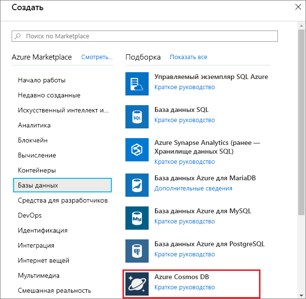
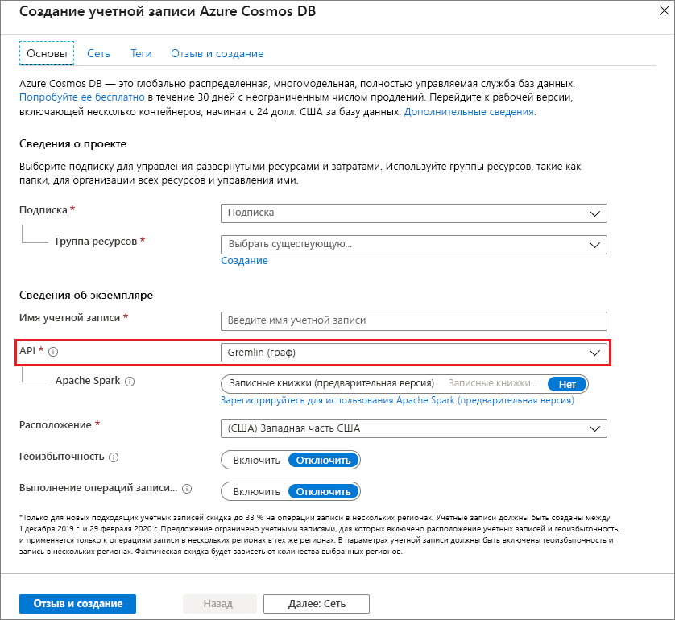
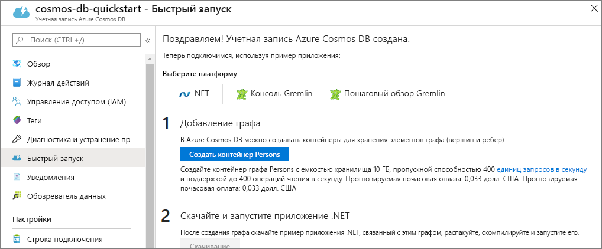

1. В новом окне браузера войдите на [портал Azure](https://portal.azure.com/).

2. Последовательно выберите **Создать ресурс** > **Базы данных** > **Azure Cosmos DB**.
   
   

3. На странице **создания учетной записи Azure Cosmos DB** введите параметры для новой учетной записи Azure Cosmos DB. 

    Параметр|Значение|ОПИСАНИЕ
    ---|---|---
    Подписка|Ваша подписка|Вы подписку Azure, которую нужно использовать для этой учетной записи Azure Cosmos DB. 
    Группа ресурсов|Создание  Введите уникальное имя, указанное в идентификаторе.|Выберите **Создать**. Затем введите новое имя группы ресурсов для учетной записи. Для удобства используйте то же имя, которое присвоено идентификатору. 
    Имя учетной записи|Введите уникальное имя.|Введите уникальное имя для идентификации вашей учетной записи Azure Cosmos DB. Так как элемент *documents.azure.com* добавляется к указанному вами идентификатору для создания URI, используйте уникальный идентификатор.  Идентификатор может содержать только строчные буквы, цифры и знак дефиса (-). Длина имени находится в диапазоне от 3 до 31 знака.
    API|Gremlin (граф)|API определяет тип учетной записи, которую нужно создать. Azure Cosmos DB предоставляет пять API: API Core (SQL) для баз данных документов, API Gremlin для баз данных графов, API MongoDB для баз данных документов, API таблиц Azure и API Cassandra. Сейчас для каждого API требуется создавать отдельную учетную запись.   Выберите **Gremlin (граф)**, так как в этом кратком руководстве создается таблица, которая работает с API Gremlin.   [Дополнительные сведения об API Graph](../articles/cosmos-db/graph-introduction.md).|
    Расположение|Выберите ближайший к пользователям регион|Выберите географическое расположение для размещения учетной записи Azure Cosmos DB. Используйте ближайшее к пользователям расположение, чтобы предоставить им максимально быстрый доступ к данным.

    Выберите **Просмотр и создание**. Можете пропустить разделы **Сеть** и **Теги**. 

    

4. Создание учетной записи займет несколько минут. Дождитесь, пока на портале откроется страница с сообщением **Congratulations! Your Azure Cosmos DB account was created** (Поздравляем! Ваша учетная запись Azure Cosmos DB создана).

    