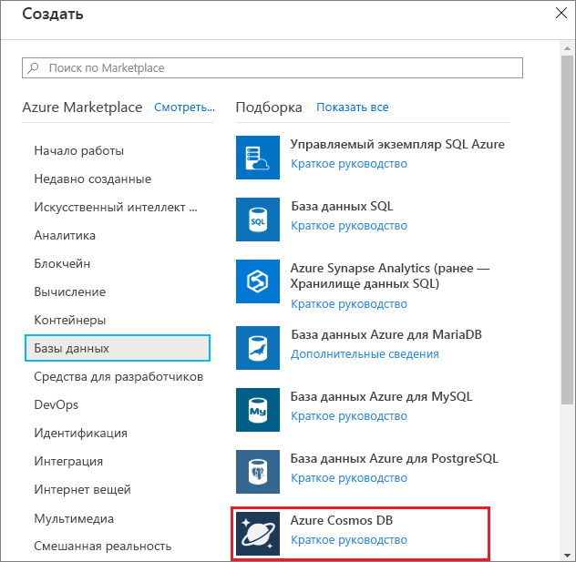
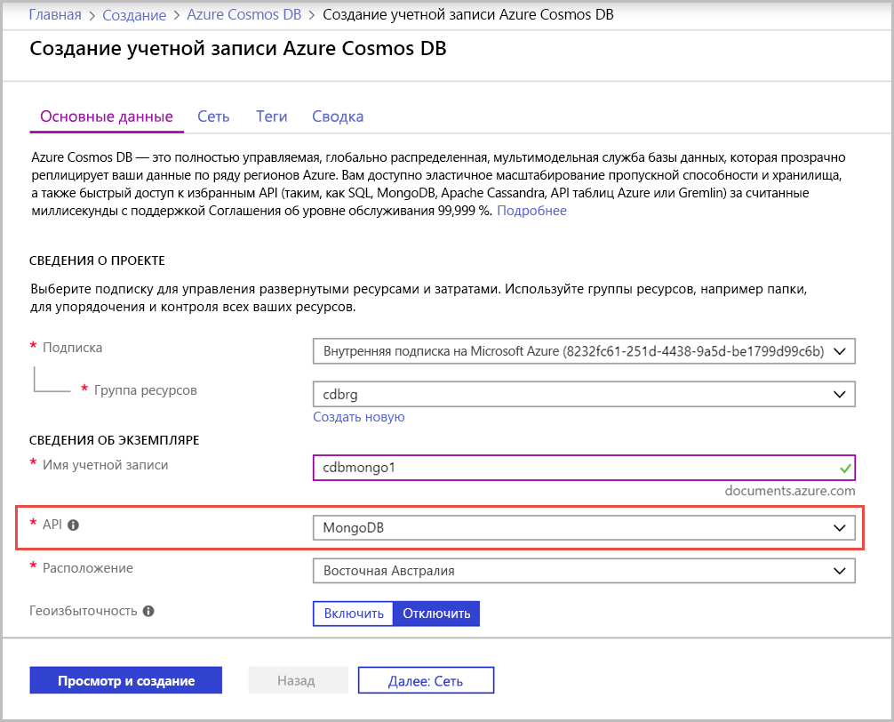
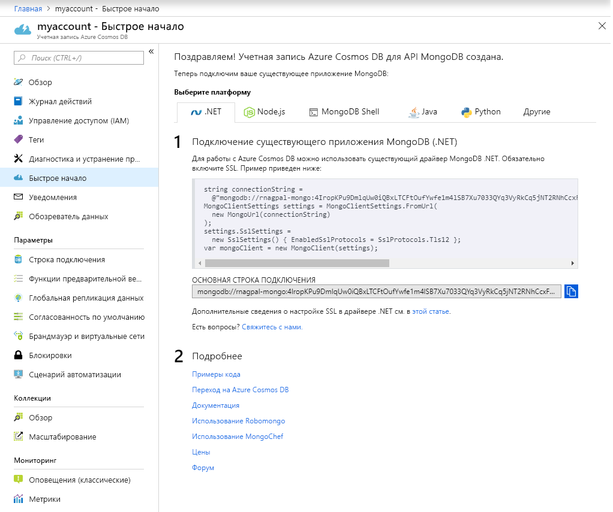

1. В новом окне войдите на [портал Azure](https://portal.azure.com/).
2. В меню слева щелкните **Создать ресурс**, **Базы данных**, а затем в разделе **Azure Cosmos DB** выберите **Создать**.
   
   

3. На странице **создания учетной записи Azure Cosmos DB** введите параметры для новой учетной записи Azure Cosmos DB. 
 
    Параметр|Значение|ОПИСАНИЕ
    ---|---|---
    Подписка|Ваша подписка|Вы подписку Azure, которую нужно использовать для этой учетной записи Azure Cosmos DB. 
    Группа ресурсов|Создание  Введите уникальное имя, указанное в идентификаторе.|Выберите **Создать**. Затем введите новое имя группы ресурсов для учетной записи. Для удобства используйте то же имя, которое присвоено идентификатору. 
    Имя учетной записи|Введите уникальное имя.|Введите уникальное имя для идентификации вашей учетной записи Azure Cosmos DB. Так как элемент *documents.azure.com* добавляется к указанному вами идентификатору для создания URI, используйте уникальный идентификатор.  Идентификатор может содержать только строчные буквы, цифры и знак дефиса (-). Длина — от 3 до 31 знака.
    API|API Azure Cosmos DB для MongoDB|API определяет тип учетной записи, которую нужно создать. Azure Cosmos DB предоставляет пять API: API Core (SQL) для баз данных документов, API Gremlin для графовых баз данных, API Azure Cosmos DB для MongoDB для баз данных документов, API таблиц Azure и API Cassandra. Сейчас для каждого API требуется создавать отдельную учетную запись.   Выберите **MongoDB**, так как в этом кратком руководстве создается таблица, которая работает с MongoDB.|
    Расположение|Выберите ближайший к пользователям регион|Выберите географическое расположение для размещения учетной записи Azure Cosmos DB. Используйте ближайшее к пользователям расположение, чтобы предоставить им максимально быстрый доступ к данным.

    Выберите **Просмотр и создание**. Можете пропустить разделы **Сеть** и **Теги**. 

    

4. Создание учетной записи займет несколько минут. Дождитесь, пока на портале откроется страница с сообщением **Congratulations! Your Cosmos account with wire protocol compatibility for MongoDB is ready** (Поздравляем! Ваша учетная запись Cosmos, обеспечивающая совместимость с сетевыми протоколами для MongoDB готова).

    
