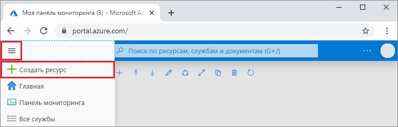

1. В новом окне браузера войдите на [портал Azure](https://portal.azure.com/).

2. В меню слева выберите **Создать ресурс**.
   
   
   
3. На странице **New** (Новый) выберите **Базы данных** > **Azure Cosmos DB**.
   
   
   
3. На странице **Создание учетной записи Azure Cosmos DB** введите параметры для новой учетной записи Azure Cosmos DB. 
 
    Параметр|Значение|Описание
    ---|---|---
    Подписка|Ваша подписка|Вы подписку Azure, которую нужно использовать для этой учетной записи Azure Cosmos DB. 
    Группа ресурсов|Создание  Затем введите имя, использованное для учетной записи|Выберите **Создать**. Затем введите новое имя группы ресурсов для учетной записи. Для удобства можно использовать то же имя, которое присвоено учетной записи Azure Cosmos DB. 
    Имя учетной записи|Введите уникальное имя.|Введите уникальное имя для идентификации вашей учетной записи Azure Cosmos DB. URI вашего аккаунта *mongo.cosmos.azure.com* будет добавлен к вашему уникальному имени аккаунта.  Имя может содержать только строчные буквы, цифры и дефисы. Его длина должна быть от 3 до 31 знаков.
    API|Azure Cosmos DB для API Mongo DB|API определяет тип учетной записи, которую нужно создать. Azure Cosmos DB предоставляет пять API: Core (SQL) для баз данных документов, Gremlin для графовых баз данных, Azure Cosmos DB для API Mongo DB для баз данных документов, таблиц Azure и Cassandra. Сейчас для каждого API требуется создавать отдельную учетную запись.   Выберите **Azure Cosmos DB для API Mongo DB**, так как в этом кратком руководстве создается коллекция, которая работает с MongoDB.  Дополнительные сведения см.[API Azure Cosmos DB для MongoDB](../articles/cosmos-db/mongodb-introduction.md).|
    Расположение|Выберите ближайший к пользователям регион|Выберите географическое расположение для размещения учетной записи Azure Cosmos DB. Используйте ближайшее к пользователям расположение, чтобы предоставить им максимально быстрый доступ к данным.|

    Выберите **Просмотр и создание**. Можете пропустить разделы **Сеть** и **Теги**. 

    

4. Создание учетной записи займет несколько минут. Дождитесь, пока на портале откроется страница с сообщением **Congratulations! Учетная запись Azure Cosmos DB для API MongoDB создана**.

    
