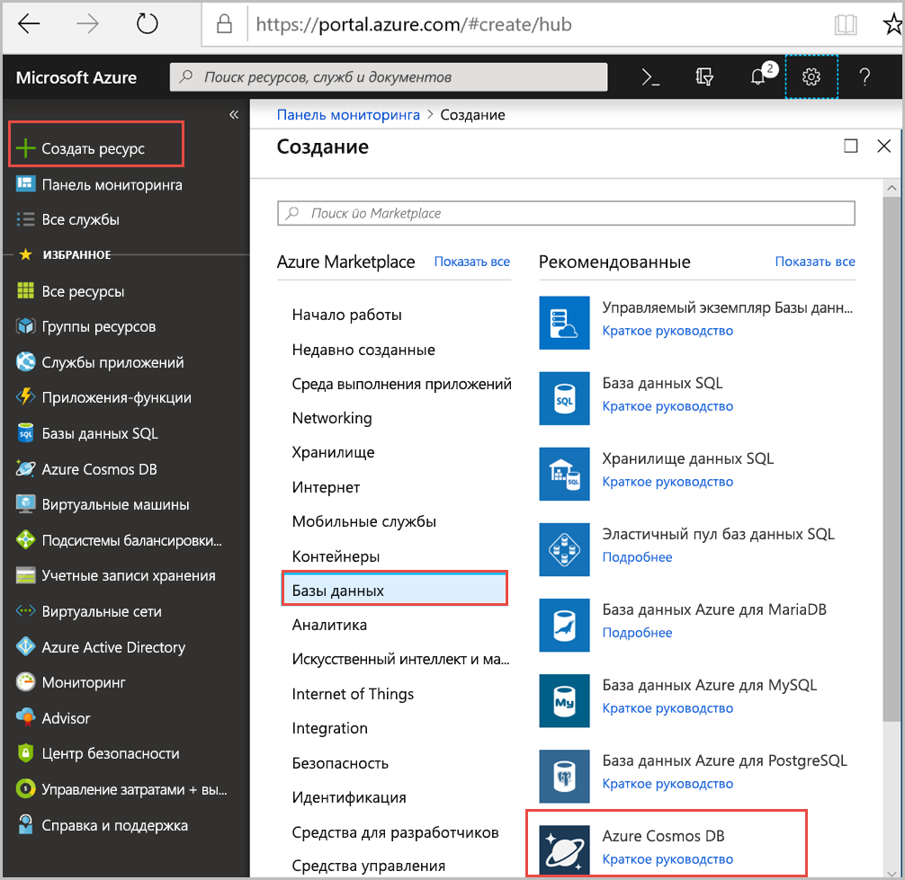
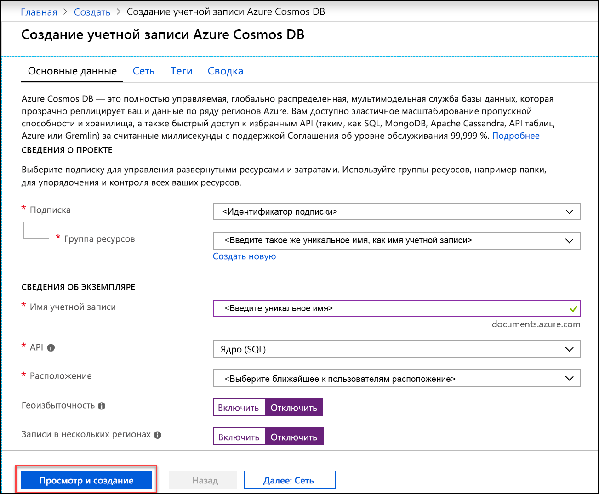
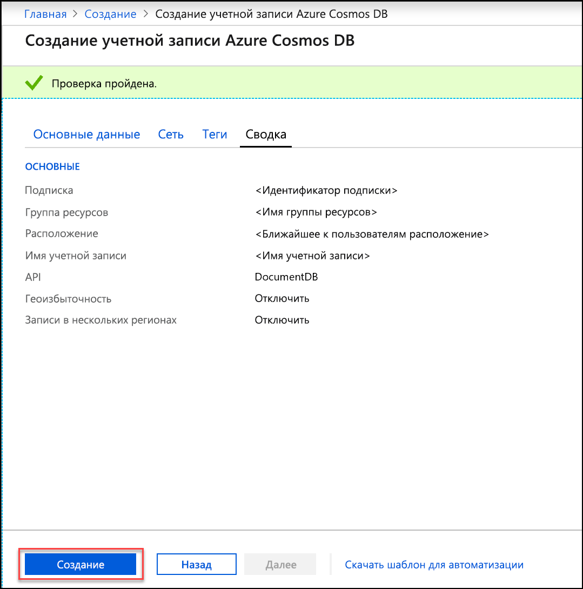
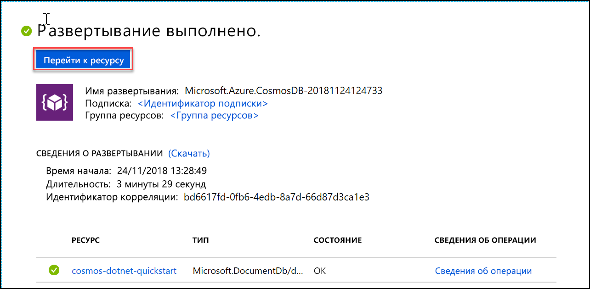
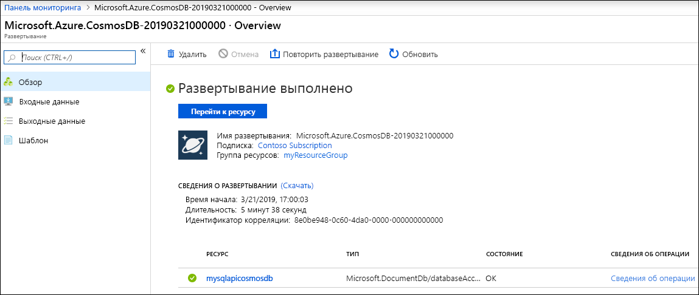

1. В новом окне браузера войдите на [портал Azure](https://portal.azure.com/).
2. Последовательно выберите **Создать ресурс** > **Базы данных** > **Azure Cosmos DB**.
   
   

3. На странице **создания учетной записи Azure Cosmos DB** введите параметры для новой учетной записи Azure Cosmos DB. 
 
    Параметр|Значение|ОПИСАНИЕ
    ---|---|---
    Подписка|*Ваша подписка*|Вы подписку Azure, которую нужно использовать для этой учетной записи Azure Cosmos DB. 
    Группа ресурсов|Создание  *Укажите уникальное имя*|Выберите **Создать** и введите новое имя группы ресурсов для учетной записи. Для удобства можно использовать то же имя, которое присвоено учетной записи. 
    Имя учетной записи|*Укажите уникальное имя*|Введите уникальное имя для идентификации вашей учетной записи Azure Cosmos DB. Так как элемент *documents.azure.com* добавляется к указанному вами идентификатору для создания URI, используйте уникальный идентификатор.  В идентификаторе должны использоваться только строчные буквы, цифры и знак дефиса (-). Длина идентификатора должна составлять от 3 до 31 символа.
    API|Core (SQL)|API определяет тип учетной записи, которую нужно создать. Azure Cosmos DB предоставляет пять API: API SQL (база данных документов), API Gremlin (база данных графов), API MongoDB (база данных документов), API таблиц и API Cassandra. Для каждого API в настоящее время требуется создание отдельной учетной записи.   Выберите API **Core (SQL)** , так как в рамках этой статьи вы создадите базу данных документов и отправите запрос к ней с использованием синтаксиса SQL.   [Дополнительные сведения об API SQL](../articles/cosmos-db/documentdb-introduction.md)|
    Расположение|*Выберите ближайший к пользователям регион*|Выберите географическое расположение для размещения учетной записи Azure Cosmos DB. Используйте ближайшее к пользователям расположение, чтобы предоставить им максимально быстрый доступ к данным.
    Включение геоизбыточности| Не указывайте | Будет создана реплицированная версия базы данных во втором регионе (из пары). Оставьте это поле пустым.  
    Выполнение операций записи в нескольких регионах| Не указывайте | Этот параметр позволяет использовать каждый регион базы данных как для чтения, так и для записи. Оставьте это поле пустым.  

    Щелкните **Просмотр и создание**. Можете пропустить разделы **Сеть** и **Теги**. 

    

    Просмотрите сводную информацию и нажмите кнопку **Создать**. 

    

4. Создание учетной записи займет несколько минут. Дождитесь, пока на портале появится сообщение **Развертывание выполнено**, и нажмите кнопку **Перейти к ресурсу**.     

    

5. На портале откроется страница с сообщением **Congratulations! Your Azure Cosmos DB account was created** (Поздравляем! Ваша учетная запись Azure Cosmos DB создана).

    

