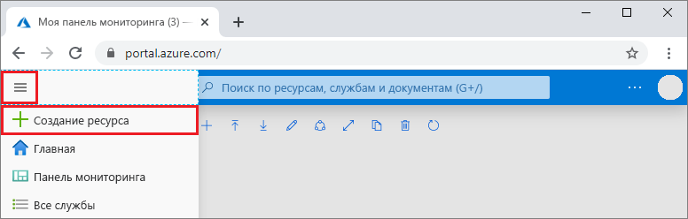

1. В новом окне браузера войдите на [портал Azure](https://portal.azure.com/).

2. В меню слева выберите **Создать ресурс**.
   
   
   
3. На странице **New** (Новый) выберите **Базы данных** > **Azure Cosmos DB**.
   
   
   
3. На странице **Создание учетной записи Azure Cosmos DB** введите параметры для новой учетной записи Azure Cosmos DB. 
 
    Параметр|Значение|Описание
    ---|---|---
    Подписка|Ваша подписка|Вы подписку Azure, которую нужно использовать для этой учетной записи Azure Cosmos DB. 
    Группа ресурсов|Щелкните **Создать**, а затем введите имя учетной записи.|Выберите **Создать**. Затем введите новое имя группы ресурсов для учетной записи. Для удобства можно использовать то же имя, которое присвоено учетной записи Azure Cosmos DB. 
    Имя учетной записи|Уникальное имя|Введите уникальное имя для идентификации вашей учетной записи Azure Cosmos DB.  Имя может содержать только строчные буквы, цифры и дефисы. Его длина должна быть от 3 до 31 знаков.
    API|Таблица|API определяет тип учетной записи, которую нужно создать. Azure Cosmos DB предоставляет пять API: API Core (SQL) для баз данных документов, API Gremlin для графовых баз данных, API MongoDB для баз данных документов, API таблиц Azure и API Cassandra. Для каждого API требуется создать отдельную учетную запись.   Выберите **Таблица Azure**, так как в этом кратком руководстве создается таблица, которая работает с API таблиц.   [Подробные сведения об API таблиц](../articles/cosmos-db/table-introduction.md).|
    Расположение|Ближайший к пользователям регион|Выберите географическое расположение для размещения учетной записи Azure Cosmos DB. Используйте ближайшее к пользователям расположение, чтобы предоставить им максимально быстрый доступ к данным.

    Вы можете не изменять значения по умолчанию для параметров **Геоизбыточность** и **Записи в нескольких регионах** (**Отключить**), чтобы избежать дополнительных затрат, и пропустить разделы **Сеть** и **Теги**.

5. Выберите **Просмотр и создание**. После завершения проверки нажмите **Создать**, чтобы создать учетную запись. 
 
   

6. Создание учетной записи занимает несколько минут. Вы увидите сообщение **Развертывание выполняется**. Дождитесь завершения развертывания, а затем нажмите кнопку **Перейти к ресурсу**.

    

