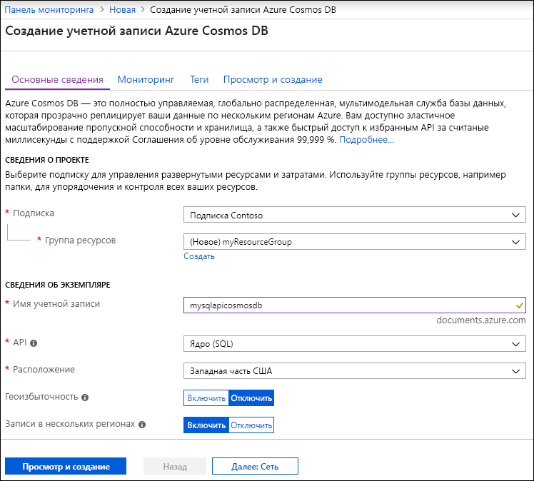
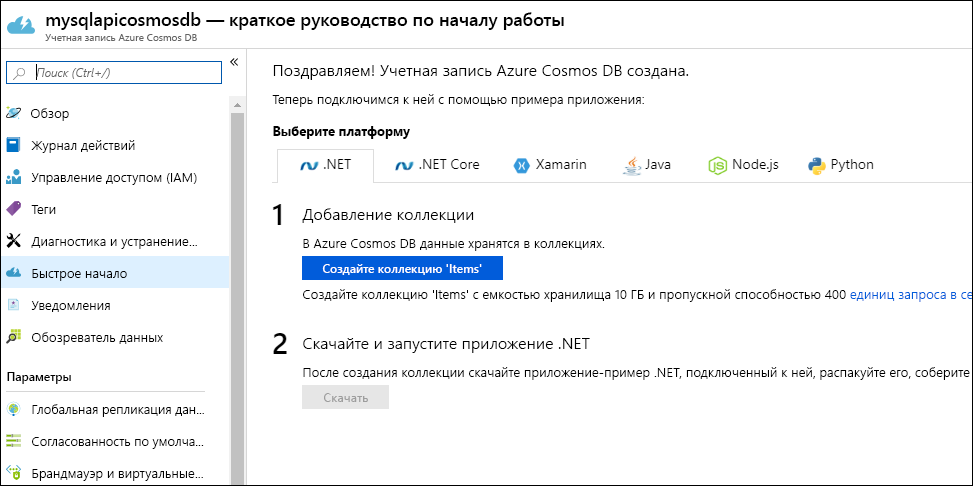

1. Войдите на [портале Azure](https://portal.azure.com/).
1. Последовательно выберите **Создать ресурс** > **Базы данных** > **Azure Cosmos DB**.

   

1. На странице **создания учетной записи Azure Cosmos DB** введите основные параметры для новой учетной записи Azure Cosmos. 

    |Параметр|Значение|ОПИСАНИЕ |
    |---|---|---|
    |Subscription|Имя подписки|Выберите подписку Azure, которую нужно использовать для этой учетной записи Azure Cosmos. |
    |Группа ресурсов|Имя группы ресурсов|Выберите группу ресурсов или **Создать**, затем введите уникальное имя для новой группы ресурсов. |
    |Имя учетной записи|Уникальное имя|Введите имя для идентификации учетной записи Azure Cosmos. Так как элемент *documents.azure.com* добавляется к указанному вами идентификатору для создания URI, используйте уникальный идентификатор.  Идентификатор может содержать только строчные буквы, цифры и знак дефиса (-). Длина — от 3 до 31 знака.|
    |API|Тип учетной записи, которую нужно создать.|Выберите **Core (SQL)** для создания базы данных документов и запроса с использованием синтаксиса SQL.   API определяет тип учетной записи, которую нужно создать. Azure Cosmos DB предоставляет пять API: Core (SQL) и MongoDB для данных документа, Gremlin для данных графа, таблица Azure и Cassandra. Сейчас для каждого API требуется создавать отдельную учетную запись.   [Дополнительные сведения об API SQL](../articles/cosmos-db/documentdb-introduction.md)|
    |Location|Ближайший к пользователям регион|Выберите географическое расположение для размещения учетной записи Azure Cosmos DB. Используйте ближайшее к пользователям расположение, чтобы предоставить им максимально быстрый доступ к данным.|

   

1. Выберите **Review + create** (Просмотреть и создать). Вы можете пропустить разделы **Сеть** и **Теги**.

1. Проверьте параметры учетной записи, а затем нажмите кнопку **Создать**. Создание учетной записи занимает несколько минут. Дождитесь, пока на странице портала появится сообщение **Развертывание выполнено**. 

    

1. Выберите **Перейти к ресурсу**, чтобы перейти на страницу учетной записи Azure Cosmos DB. 

    
