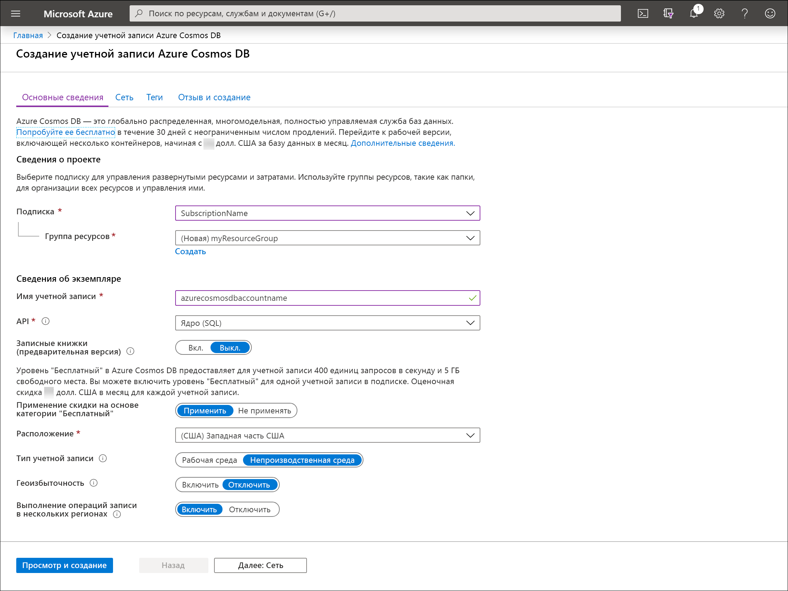

1. Создайте учетную запись для базы данных Azure Cosmos DB, [перейдя на портал Azure](https://portal.azure.com/). Найдите в поиске и выберите **Azure Cosmos DB**

   

1. Выберите **Добавить**.
1. На странице **создания учетной записи Azure Cosmos DB** введите основные параметры для новой учетной записи Azure Cosmos. 

    |Параметр|Значение|Описание |
    |---|---|---|
    |Подписка|имя подписки;|Выберите подписку Azure, которую нужно использовать для этой учетной записи Azure Cosmos. |
    |Группа ресурсов|Имя группы ресурсов|Выберите группу ресурсов или **Создать**, затем введите уникальное имя для новой группы ресурсов. |
    |Имя учетной записи|Уникальное имя|Введите имя для идентификации учетной записи Azure Cosmos. Так как элемент *documents.azure.com* добавляется к указанному вами имени для создания URI, используйте уникальное имя.  Имя может содержать только строчные буквы, цифры и знак дефиса (-). Длина — от 3 до 31 знака.|
    |API|Тип учетной записи, которую нужно создать.|Выберите **Core (SQL)** для создания базы данных документов и запроса с использованием синтаксиса SQL.   API определяет тип учетной записи, которую нужно создать. Azure Cosmos DB предоставляет пять API: Core (SQL) и MongoDB для данных документа, Gremlin для данных графа, таблица Azure и Cassandra. Сейчас для каждого API требуется создавать отдельную учетную запись.   [Дополнительные сведения об API SQL](../articles/cosmos-db/documentdb-introduction.md)|
    |Применение скидки на основе категории "Бесплатный"|Применить или не применять|В категории "Бесплатный" Azure Cosmos DB для учетной записи бесплатно предоставляются первые 400 единиц запросов в секунду и 5 ГБ свободного места. Ознакомьтесь с дополнительными сведениями о [категории "Бесплатный"](https://azure.microsoft.com/pricing/details/cosmos-db/).|
    |Расположение|Ближайший к пользователям регион|Выберите географическое расположение для размещения учетной записи Azure Cosmos DB. Используйте ближайшее к пользователям расположение, чтобы предоставить им максимально быстрый доступ к данным.|
    |Тип учетной записи|Рабочие нагрузки, предназначенные и не предназначенные для рабочей среды|Выберите **Production** (Для рабочей среды), если учетная запись будет использоваться для рабочей нагрузки, предназначенной для рабочей среды. Выберите **Non-Production** (Не для рабочей среды), если учетная запись будет использоваться не для рабочей среды, например для разработки, тестирования, контроля качества или для промежуточной среды. Это параметр тега ресурса Azure, отвечающий за настройку интерфейса портала. Этот параметр не влияет на базовую учетную запись Azure Cosmos DB. Это значение можно изменить в любое время.|

    > [!NOTE]
    > Вы можете использовать не более одной учетной записи Azure Cosmos DB категории "Бесплатный" на подписку Azure. При создании учетной записи нужно зарегистрироваться. Если параметр подачи заявки на скидку на основе категории "Бесплатный" не отображается, это означает, что в подписке уже включена другая учетная запись категории "Бесплатный".
   
   

1. Выберите **Review + create** (Просмотреть и создать). Вы можете пропустить разделы **Сеть** и **Теги**.

1. Проверьте параметры учетной записи, а затем нажмите кнопку **Создать**. Создание учетной записи занимает несколько минут. Дождитесь, пока на странице портала появится сообщение **Развертывание выполнено**. 

    

1. Выберите **Перейти к ресурсу**, чтобы перейти на страницу учетной записи Azure Cosmos DB. 

    
