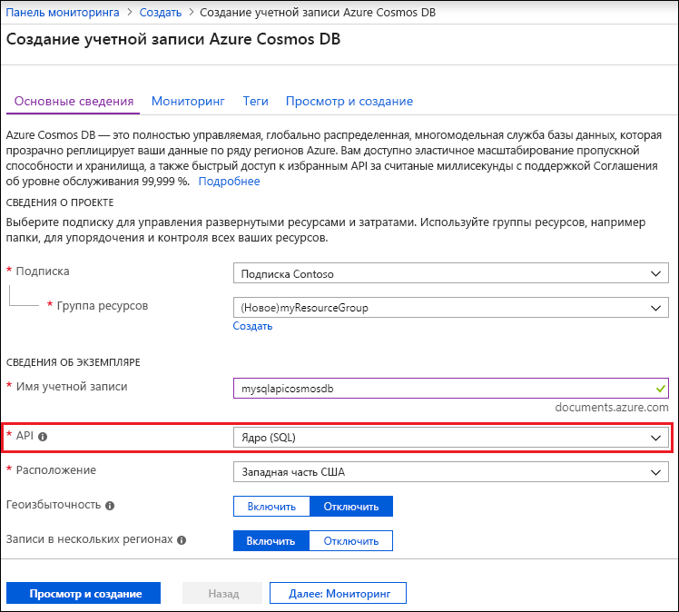

1. В новом окне браузера войдите на [портал Azure](https://portal.azure.com/).
2. Последовательно выберите **Создать ресурс** > **Базы данных** > **Azure Cosmos DB**.
   
   

3. На странице **Новая учетная запись** введите параметры для новой учетной записи Azure Cosmos DB. 
 
    Параметр|Значение|ОПИСАНИЕ
    ---|---|---
    ИД|Введите уникальное имя.|Введите уникальное имя для идентификации вашей учетной записи Azure Cosmos DB. Так как элемент *documents.azure.com* добавляется к указанному вами идентификатору для создания URI, используйте уникальный идентификатор.  Идентификатор может содержать только строчные буквы, цифры и знак дефиса (-). Он должен содержать от 3 до 50 символов.
    API|SQL|API определяет тип учетной записи, которую нужно создать. Azure Cosmos DB предоставляет пять API: API SQL для баз данных документов, API Gremlin для баз данных графов, API MongoDB для баз данных документов, API таблиц и API Cassandra. Сейчас для каждого API требуется создавать отдельную учетную запись.   Выберите API **SQL**, так как в рамках этой статьи вы создадите базу данных документов и отправите запрос к ней с использованием синтаксиса SQL.   [Дополнительные сведения об API SQL](../articles/cosmos-db/documentdb-introduction.md)|
    Подписка|Ваша подписка|Вы подписку Azure, которую нужно использовать для этой учетной записи Azure Cosmos DB. 
    Группа ресурсов|Создание  Введите уникальное имя, указанное в идентификаторе.|Выберите **Создать**. Затем введите новое имя группы ресурсов для учетной записи. Для удобства используйте то же имя, которое присвоено идентификатору. 
    Расположение|Выберите ближайший к пользователям регион|Выберите географическое расположение для размещения учетной записи Azure Cosmos DB. Используйте ближайшее к пользователям расположение, чтобы предоставить им максимально быстрый доступ к данным.
    Включение геоизбыточности| Не указывайте | Этот параметр позволяет создать реплицированную версию базы данных во втором регионе (из пары). Не устанавливайте этот флажок. 

    Нажмите кнопку **Создать**.

    

4. Создание учетной записи займет несколько минут. Дождитесь, пока на портале откроется страница с сообщением **Congratulations! Your Azure Cosmos DB account was created** (Поздравляем! Ваша учетная запись Azure Cosmos DB создана).

    

