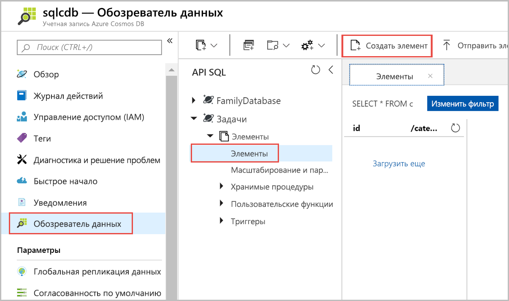
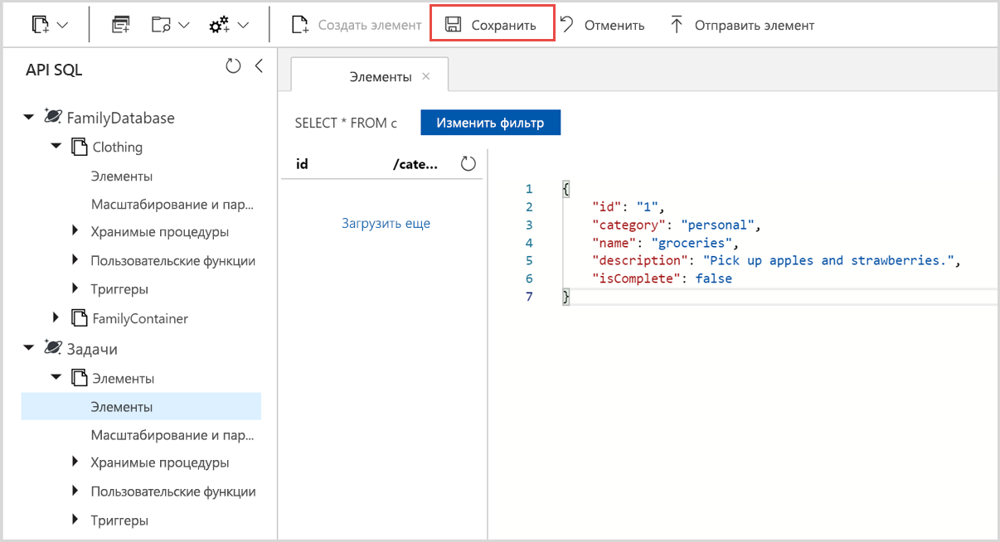

Теперь вы можете добавить данные в новый контейнер с помощью Data Explorer.

1. В **Data Explorer** разверните базу данных**Tasks**, а затем контейнер **Элементы**. Выберите **Элементы**, а потом — **Новый элемент**.

   
  
2. Теперь можно добавить документ в контейнер со следующей структурой.

     ```json
     {
         "id": "1",
         "category": "personal",
         "name": "groceries",
         "description": "Pick up apples and strawberries.",
         "isComplete": false
     }
     ```

3. Добавив данные JSON на вкладке **Документы**, щелкните **Сохранить**.

    

4.  Создайте и сохраните один или несколько документов, задав уникальное значение для свойства `id`, и измените другие свойства по своему усмотрению. Новые документы могут иметь любую структуру, так как Azure Cosmos DB не устанавливает определенные схемы данных.