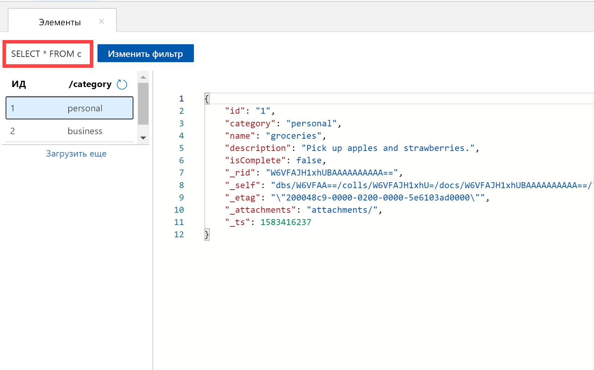
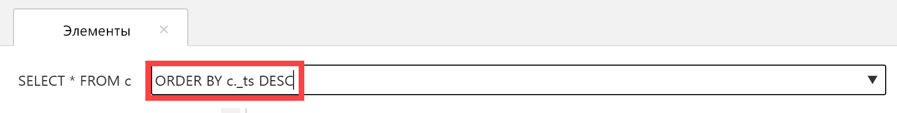
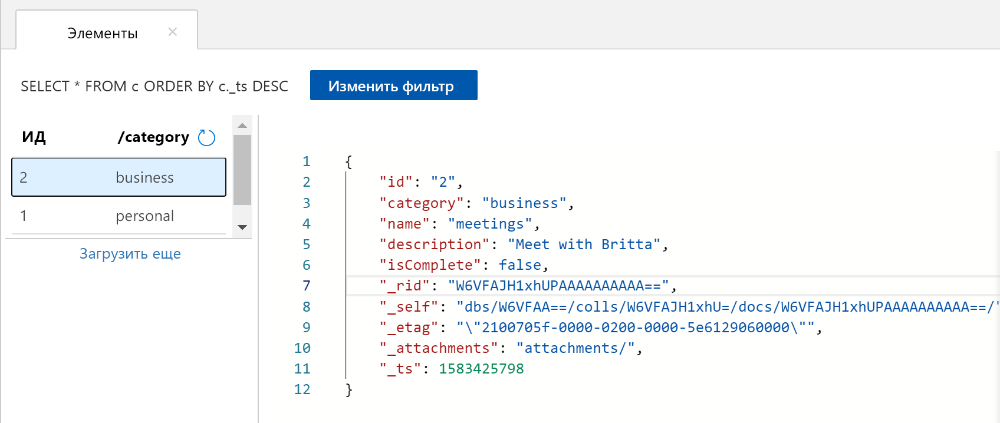

Вы можете применить запросы в обозревателе данных для получения и фильтрации данных.

1. В верхней части вкладки **Документы** в обозревателе данных просмотрите запрос по умолчанию `SELECT * FROM c`. Этот запрос извлекает и отображает все документы в коллекции по порядку идентификаторов. 
   
   
   
1. Чтобы изменить запрос, выберите **Изменить фильтр**, замените запрос по умолчанию на `ORDER BY c._ts DESC`, а затем выберите **Применить фильтр**.
   
   

   Измененный запрос отображает все документы в порядке убывания метки времени, поэтому теперь первым в списке будет второй документ. 
   
   

Если вы знакомы с синтаксисом SQL, используйте в этом поле предиката запроса любой поддерживаемый [SQL-запрос](../articles/cosmos-db/sql-api-sql-query.md). Вы также можете использовать обозреватель данных для создания хранимых процедур, определяемых пользователем функций и триггеров для бизнес-логики на стороне сервера. 

Это средство предоставляет легкий доступ на портале Azure ко всем встроенным возможностям программного доступа к данным, доступным в API-интерфейсах. Вы можете также воспользоваться порталом, чтобы масштабировать пропускную способность, получить ключи и строки подключения и просмотреть метрики и Соглашения об уровне обслуживания для своей учетной записи Azure Cosmos DB. 

