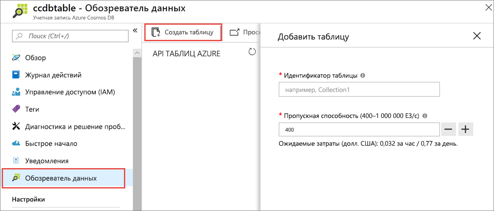
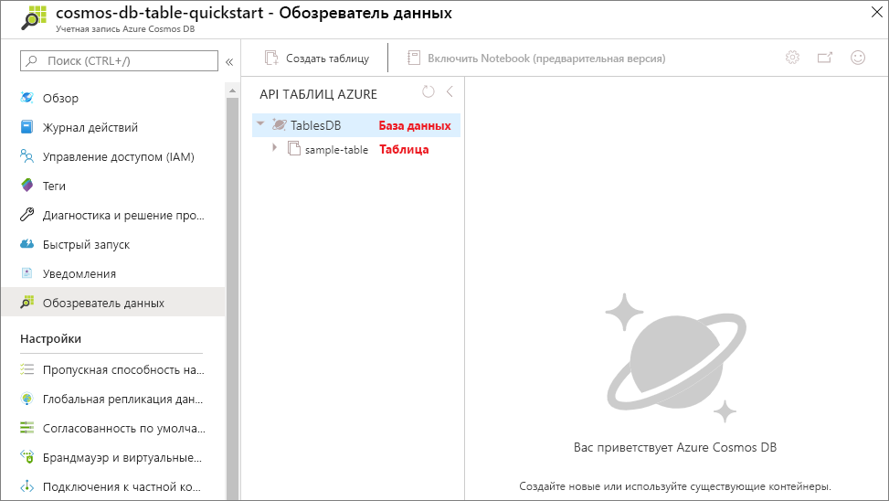

Теперь вы можете использовать средство обозреватель данных на портале Azure для создания базы данных и таблицы. 

1. Щелкните **Обозреватель данных** > **New Table** (Новая таблица). 
    
    Справа отобразится область **Добавление таблицы** (вам может потребоваться прокрутить вправо, чтобы увидеть ее).

    

2. На странице **Добавление таблицы** введите параметры для новой таблицы.

    Параметр|Рекомендуемое значение|ОПИСАНИЕ
    ---|---|---
    Идентификатор таблицы|Пример таблицы|Идентификатор новой таблицы. Для имен таблиц предусмотрены те же требования к знакам, что и для идентификаторов баз данных. Имя базы данных может иметь длину от 1 до 255 символов и не может содержать `/ \ # ?` или пробел.
    Пропускная способность|400 ЕЗ|Укажите для пропускной способности 400 единиц запросов в секунду. Чтобы сократить задержку, позже вы можете увеличить масштаб пропускной способности.

3. Последовательно выберите **ОК**.

4. В обозревателе данных отобразится новая база данных и таблица.

   