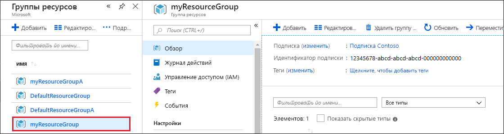
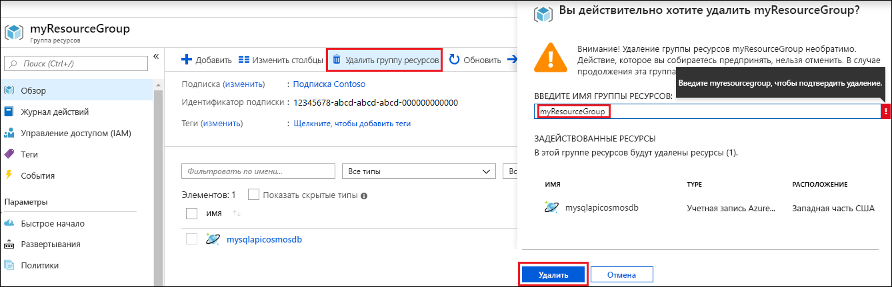

После завершения работы с веб-приложением и учетной записью Azure Cosmos DB можно удалить созданные ресурсы Azure, чтобы не нести дополнительные расходы. Удаление ресурсов:

1. На портале Azure выберите **Группы ресурсов** в левой части окна. Если меню слева свернуто, выберите , чтобы развернуть его.

2. Выберите группу ресурсов, созданную для этого краткого руководства.  

   

2. В новом окне выберите **Удалить группу ресурсов**.

      

3. В следующем окне введите имя группы ресурсов, которую требуется удалить, и щелкните **Удалить**.

