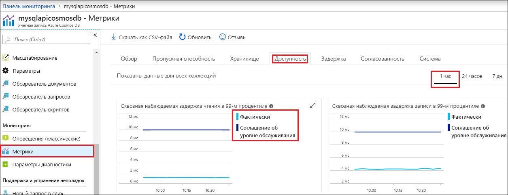

На портале Azure можно отслеживать пропускную способность, объем хранилища, доступность, задержку и согласованность учетной записи Cosmos DB. На диаграммах метрик, связанных с [соглашением об уровне обслуживания для Azure Cosmos DB](https://azure.microsoft.com/support/legal/sla/cosmos-db/), отображается значение, указанное в соглашении об уровне обслуживания, в сравнении с фактической производительностью. Этот набор метрик обеспечивает прозрачный мониторинг выполнения соглашения об уровне обслуживания.

Чтобы просмотреть метрики и соглашения об уровне обслуживания, сделайте следующее: 

1. Выберите **Метрики** в меню навигации учетной записи Cosmos DB.
   
2. Выберите вкладку, например **Задержка**, и укажите временной интервал справа. Сравните на диаграмме строки **Actual** (Фактическое значение) и **SLA** (Соглашение об уровне обслуживания).
   
   
   
3. Просмотрите метрики на других вкладках. 

