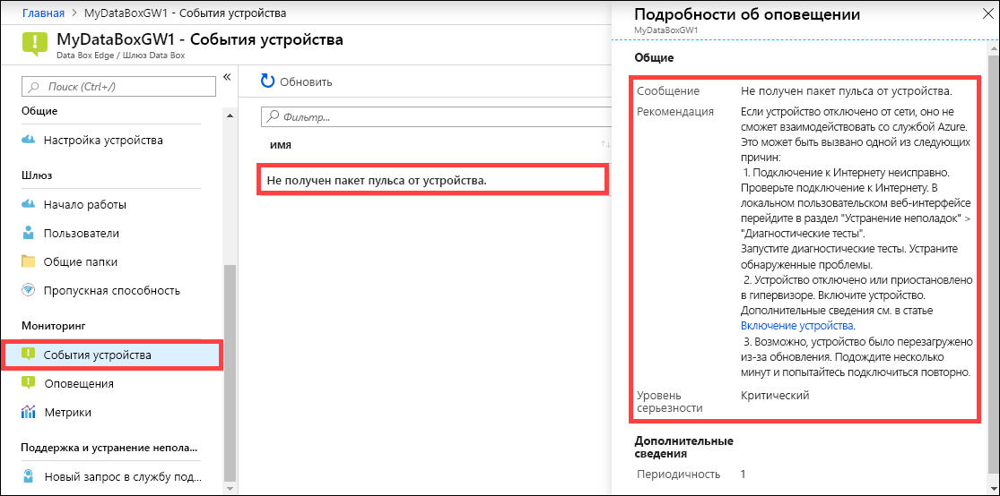

Чтобы просмотреть событие устройства на портале Azure, выполните шаги ниже.

1. На портале Azure выберите ресурс Data Box Edge или Шлюза Data Box и перейдите в раздел **Мониторинг > События устройства**.
2. Выберите событие и просмотрите сведения об оповещении. Предпримите необходимые шаги, чтобы разрешить проблему, которая вызвала создание оповещения.

    