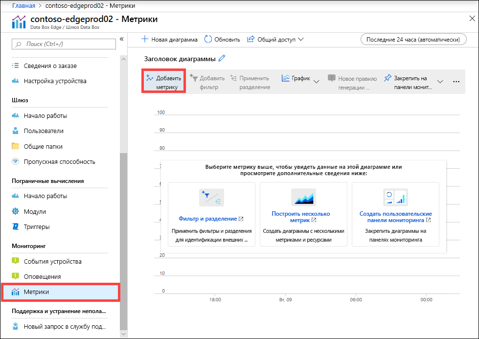
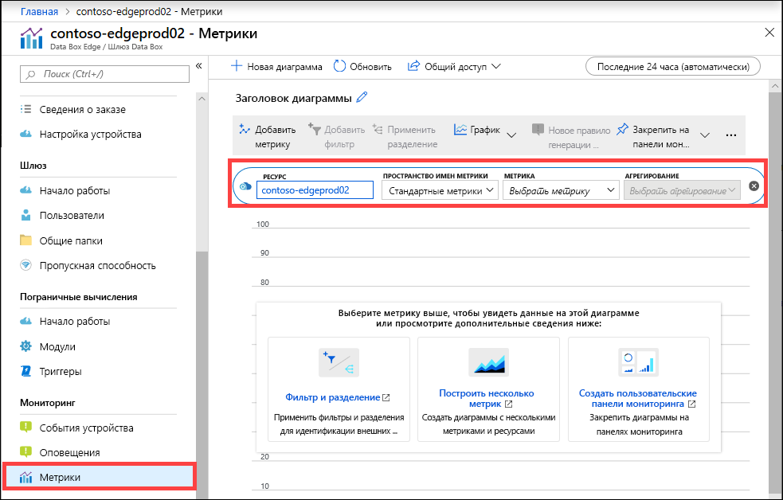
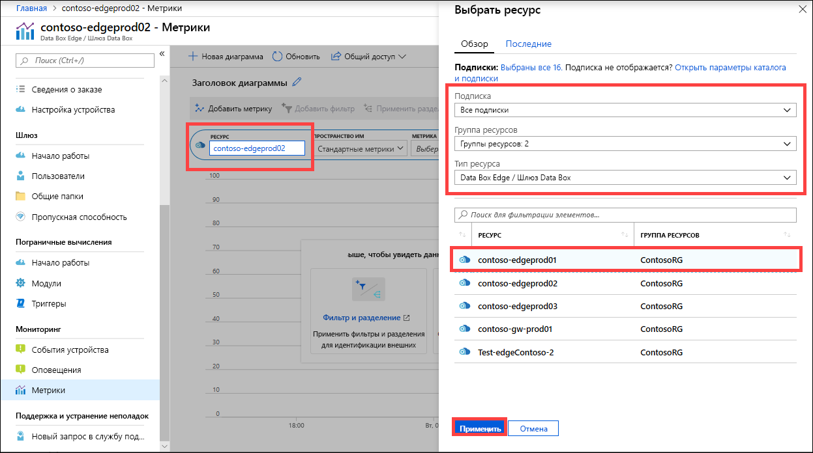
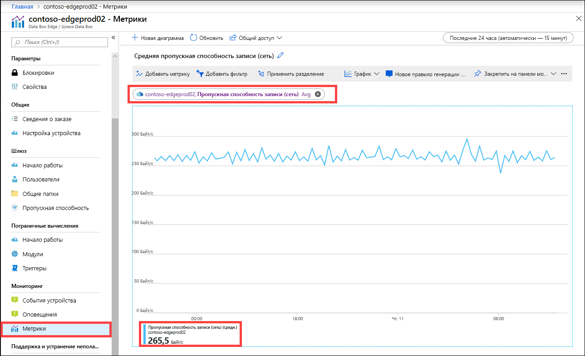
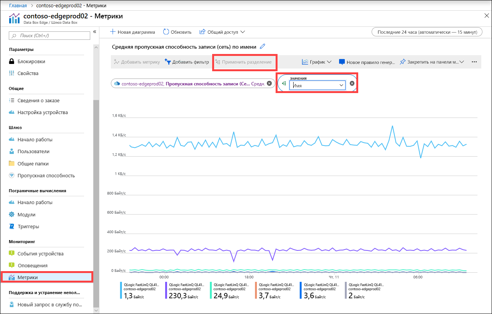
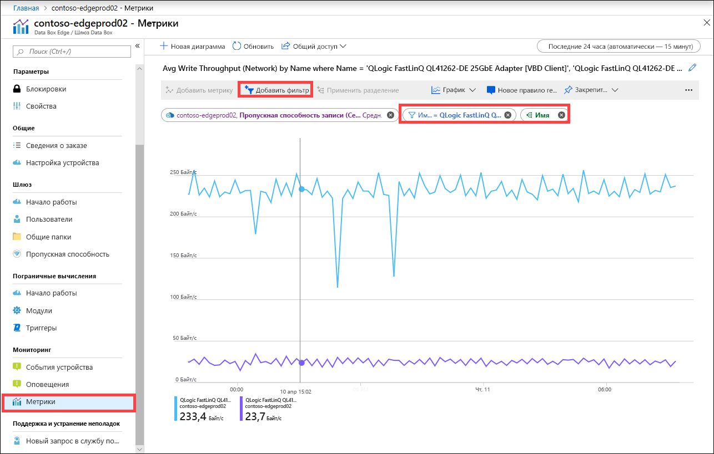

Кроме того, вы можете просматривать метрики для мониторинга производительности устройства и при необходимости устранять с их помощью неполадки.

Чтобы создать схему по выбранным метрикам устройства, выполните следующие действия на портале Azure:

1. На портале Azure откройте раздел **Мониторинг > Метрики** для нужного ресурса и щелкните **Добавить метрику**.

    

2. Ресурс указывается автоматически.  

    

    Чтобы указать другой ресурс, выберите его. В колонке **Выберите ресурс** выберите подписку, группу ресурсов, тип ресурса и конкретный ресурс, для которого вам нужно отобразить метрики, затем щелкните **Применить**.

    

3. В раскрывающемся списке выберите метрику для мониторинга устройства. Здесь вам доступны **метрики емкости** и **метрики транзакций**. Метрики емкости связаны с емкостью устройства. Метрики транзакций связаны с операциями чтения и записи в хранилище Azure.

    |Метрики емкости                     |ОПИСАНИЕ  |
    |-------------------------------------|-------------|
    |**Доступная емкость**               | Обозначает размер данных, который можно записать на устройство. Другими словами, это доступная для предоставления на устройстве емкость.   Чтобы освободить дополнительную емкость на устройстве, удалите локальные копии файлов, которые хранятся и на устройстве, и в облаке.        |
    |**Общая емкость**                   | Обозначает общее число байтов на устройстве, куда записываются данные. Этот параметр называют общим размером локального кэша.    Вы можете увеличить емкость существующего виртуального устройства, добавив новый диск данных. Диск данных можно добавить с помощью функции управления гипервизором для виртуальной машины с последующим перезапуском виртуальной машины. Пул локального хранилища для устройства шлюза будет увеличен с учетом нового диска данных.   Дополнительные сведения см. в видео [добавлении жесткого диска на виртуальную машину Hyper-V](https://www.youtube.com/watch?v=EWdqUw9tTe4). |
    
    |Метрики транзакций              | ОПИСАНИЕ         |
    |-------------------------------------|---------|
    |**Отправлено байт для облака (устройство)**    | Общий объем данных (в байтах), загруженных во все общие папки на устройстве.        |
    |**Отправлено байт для облака (общая папка)**     | Сведения об объеме переданных данных (в байтах) для каждой общей папки. Это может быть:    Avg, то есть сумма всех отправленных данных (в байтах), поделенная на количество общих папок;    Max, то есть максимальный объем данных (в байтах), отправленных из общей папки;   Min, то есть минимальное объем данных (в байтах), отправленных из общей папки.      |
    |**Пропускная способность скачивания для облака (общая папка)**| Сведения об объеме скачанных данных (в байтах) для каждой общей папки. Это может быть:    Avg, то есть объем всех считанных или скачанных данных (в байтах), поделенная на количество общих папок;    Max, то есть максимальный объем данных (в байтах), скачанных из общей папки;   Min, то есть минимальный объем данных (в байтах), скачанных из общей папки.  |
    |**Пропускная способность чтения для облака**            | Суммарный объем данных (в байтах), считанных из облака, по всем общим папкам на устройстве.     |
    |**Пропускная способность отправки для облака**          | Суммарный объем данных (в байтах), записанных в облако, по всем общим папкам на устройстве.     |
    |**Пропускная способность отправки для облака (общий ресурс)**  | Суммарный объем данных (в байтах), записанных в облако из общей папки в среднем по общим папкам, максимальное и минимальное значение для общей папки.      |
    |**Пропускная способность чтения (сеть)**           | Включает пропускную способность сети по всему объему данных (в байтах), считанных из облака. Это представление может содержать данные, которые не привязаны к общим папкам.   При разделении отображается трафик по всем сетевым адаптерам на устройстве. Сюда входят даже те адаптеры, которые не подключены или не активированы.      |
    |**Пропускная способность записи (сеть)**       | Включает пропускную способность сети по всему объему данных (в байтах), записанных в облако. Это представление может содержать данные, которые не привязаны к общим папкам.   При разделении отображается трафик по всем сетевым адаптерам на устройстве. Сюда входят даже те адаптеры, которые не подключены или не активированы.          |
    |**Пограничные вычисления — использование памяти**      | Эта метрика не применима для шлюза Data Box и поэтому не заполняется.          |
    |**Пограничные вычисления — процент загрузки ЦП**    | Эта метрика не применима для шлюза Data Box и поэтому не заполняется.         |

4. При выборе метрики из раскрывающегося списка вы можете дополнительно определить функцию статистической обработки. Статистическое выражение вычисляется по фактическому значению за указанный промежуток времени. В качестве статистического выражения можно выбрать среднее, минимальное или максимальное значение. Для поля "Статистическое выражение" выберите значение Avg, Max или Min.

    

5. Если к выбранной метрике относятся несколько экземпляров, можно разделить их. Выберите **Применить разделение** и выберите значение, по которому его нужно выполнить.

    

6. Теперь, если вам потребуется открыть распределение только для нескольких экземпляров, данные можно отфильтровать. Например, предположим, что вас интересует пропускная способность сети только для двух подключенных сетевых интерфейсов на вашем устройстве. Вы можете отфильтровать эти интерфейсы. Выберите **Добавить фильтр** и укажите имя сетевого интерфейса, который будете фильтровать.

    

7. Вы можете закрепить диаграмму на панели мониторинга для быстрого доступа к ней.

    

8. Чтобы экспортировать данные диаграммы в электронную таблицу Excel или получить ссылку, которая позволяет предоставить диаграмму другим пользователям, выберите элемент общего доступа на панели команд.

    