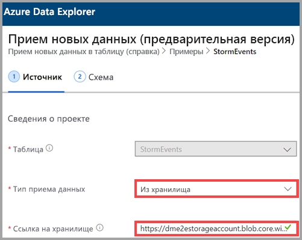
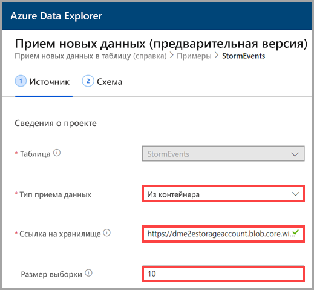
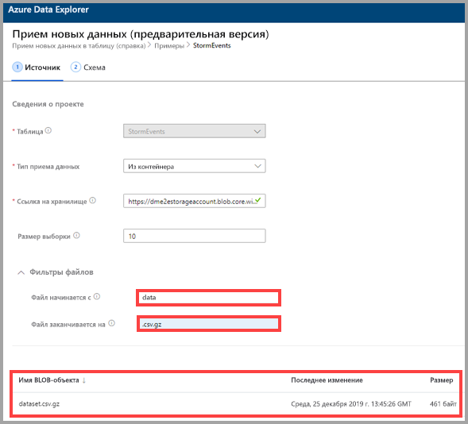

## Выберите тип приема данных

Для параметра **Ingestion type** (Тип приема данных) вы берите один из таких вариантов:
   * **Из хранилища**: в поле **Link to storage** (Ссылка на хранилище) добавьте URL-адрес учетной записи хранения. Для частных учетных записей хранения используйте [подписанный URL-адрес BLOB-объекта](/azurevs-azure-tools-storage-explorer-blobs#get-the-sas-for-a-blob-container).
   
      

    * **Из файла**: нажмите кнопку **Обзор**, чтобы найти файл, или перетащите файл в поле.
  
      

    * **from container** (Из контейнера): в поле **Link to storage** (Ссылка на хранилище) добавьте [подписанный URL-адрес](/azure/vs-azure-tools-storage-explorer-blobs#get-the-sas-for-a-blob-container) контейнера и при необходимости укажите размер выборки.

      

  Появится пример данных. При необходимости можно отфильтровать эти данные, чтобы отображались только те файлы, имена которых в начале или в конце имеют определенные символы. Когда вы меняете фильтры, содержимое в окне предварительного просмотра обновляется автоматически.
  
  Например, можно выполнить фильтрацию по всем файлам, имена которых начинаются со слова *data* и заканчиваются расширением *.csv.gz*.

  
