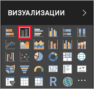
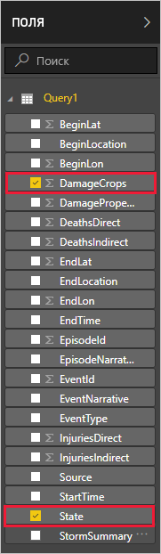
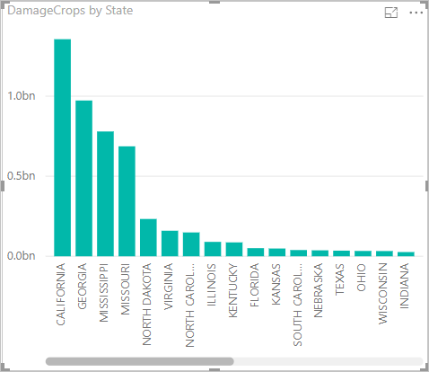

Теперь у вас есть данные в Power BI Desktop, можно создавать отчеты на их основе. Вы создадите простой отчет с гистограммой, на которой показан урон посевам по штатам.

1. В левой части основного окна Power BI выберите представление отчетов.

    

1. В области **ВИЗУАЛИЗАЦИИ** выберите гистограмму с кластерами.

    

    Пустая диаграмма добавляется на холст.

    

1. В списке **Поля** выберите **DamageCrops** и **State**.

    

    Теперь у вас есть диаграмма, показывающая урон посевам в первых 1000 строках в таблице.

    

1. Сохраните отчет.