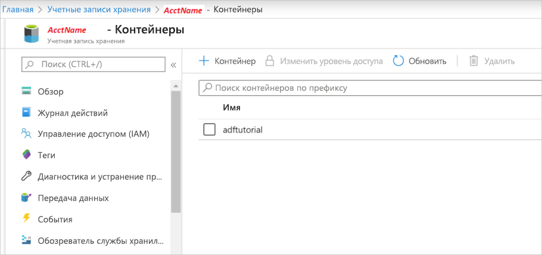
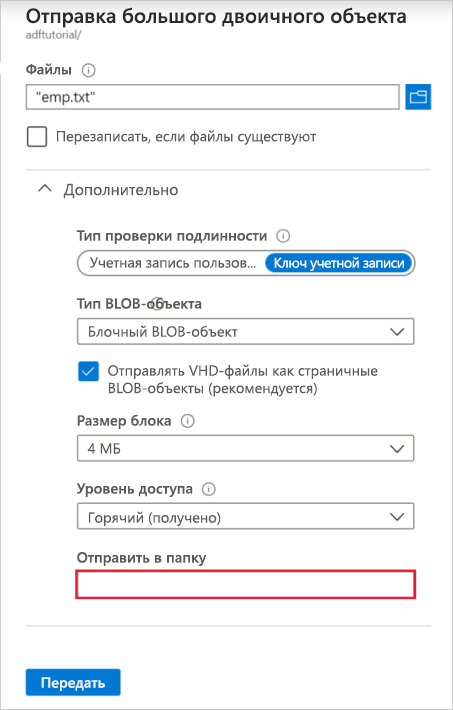

## <a name="prerequisites"></a>Предварительные требования

### <a name="azure-subscription"></a>Подписка Azure.
Если у вас еще нет подписки Azure, [создайте бесплатную учетную запись Azure](https://azure.microsoft.com/free/), прежде чем начинать работу.

### <a name="azure-roles"></a>Роли Azure
Чтобы создать экземпляры фабрики данных, нужно назначить учетной записи пользователя, используемой для входа в Azure, роль *участника*, *владельца* либо *администратора* подписки Azure. Чтобы просмотреть имеющиеся разрешения в подписке на [портале Azure](https://portal.azure.com), выберите имя пользователя в правом верхнем углу и выберите **Дополнительные настройки** (...), а затем выберите **Мои разрешения**. Если у вас есть доступ к нескольким подпискам, выберите соответствующую подписку.

Чтобы создавать дочерние ресурсы для службы "Фабрика данных", в том числе наборы данных, связанные службы, конвейеры, триггеры и среды выполнения интеграции, а также управлять ими, выполните следующие требования:

- Чтобы создавать дочерние ресурсы и управлять ими на портале Azure, необходимо иметь роль **Участник Фабрики данных** на уровне группы ресурсов или более высоком.
- Чтобы создавать дочерние ресурсы и управлять ими с помощью PowerShell или пакета SDK, достаточно роли **Участник** на уровне ресурса или более высоком.

Примеры инструкций по назначению пользователю роли см. в статье [Добавление или изменение администраторов подписки Azure](../articles/billing/billing-add-change-azure-subscription-administrator.md).

Дополнительные сведения см. в следующих ресурсах:

- [Участник Фабрики данных](../articles/role-based-access-control/built-in-roles.md#data-factory-contributor)
- [Roles and permissions for Azure Data Factory](../articles/data-factory/concepts-roles-permissions.md) (Роли и разрешения для службы "Фабрика данных Azure")

### <a name="azure-storage-account"></a>Учетная запись хранения Azure.
В этом кратком руководстве в качестве *исходного* и *целевого* хранилища данных используется учетная запись хранения Azure общего назначения (в частности, хранилища BLOB-объектов). Если у вас нет учетной записи хранения Azure общего назначения, см. инструкции по [созданию учетной записи хранения](../articles/storage/common/storage-quickstart-create-account.md). 

#### <a name="get-the-storage-account-name"></a>Получение имени учетной записи хранения
Для выполнения инструкций этого краткого руководства вам потребуется имя учетной записи хранения Azure. Далее описана процедура получения имени учетной записи хранения. 

1. В веб-браузере перейдите к [Портал Azure](https://portal.azure.com) и выполните вход с помощью имени пользователя и пароля Azure.
2. В меню портала Azure выберите **Все службы**, а затем выберите **Хранилище** > **Учетные записи хранения**. Можно также выполнить поиск на любой странице и выбрать *Учетные записи хранения*.
3. На странице **Учетные записи хранения** найдите с помощью фильтра свою учетную запись хранения (при необходимости), а затем выберите эту учетную запись. 

Можно также выполнить поиск на любой странице и выбрать *Учетные записи хранения*.

#### <a name="create-a-blob-container"></a>Создание контейнера BLOB-объектов
В этом разделе вы создадите контейнер больших двоичных объектов с именем **adftutorial** в хранилище BLOB-объектов Azure.

1. На странице учетной записи хранения выберите **Общие сведения** > **Большие двоичные объекты**.
2. На панели инструментов *\<Имя учетной записи* - **BLOB-объекты** выберите **Контейнер**.
3. В диалоговом окне **Создание контейнера** введите **adftutorial** в качестве имени и щелкните **ОК**. Страница *\<Имя учетной записи* - **BLOB-объекты** обновлена для включения **adftutorial** в список контейнеров.

   

#### <a name="add-an-input-folder-and-file-for-the-blob-container"></a>Добавление входной папки и файла для контейнера BLOB-объектов
Создайте в этом разделе папку с именем **input** в только что созданном контейнере, а затем загрузите пример файла во входную папку. Прежде чем начать, откройте текстовый редактор, например **Блокнот** и создайте файл **emp.txt** с таким содержимым:

```emp.txt
John, Doe
Jane, Doe
```

Сохраните файл в папке**C:\ADFv2QuickStartPSH**. (Если папка не существует, создайте ее.) После этого вернитесь на портал Azure и выполните следующие действия.

1. На странице *\<Имя учетной записи* - **BLOB-объекты**, где вы остановились, выберите **adftutorial** в обновленном списке контейнеров.

   1. Если вы закрыли окно или перешли на другую страницу, снова войдите на [портал Azure](https://portal.azure.com).
   1. В меню портала Azure выберите **Все службы**, а затем выберите **Хранилище** > **Учетные записи хранения**. Можно также выполнить поиск на любой странице и выбрать *Учетные записи хранения*.
   1. Выберите свою учетную запись хранения, а затем выберите **Большие двоичные объекты** > **adftutorial**.

2. На панели инструментов **adftutorial** страницы контейнера выберите **Отправка**.
3. На странице **Отправка BLOB-объектов** выберите поле **Файлы**, а затем найдите и выберите файл **emp.txt**.
4. Разверните заголовок **Дополнительно**. Теперь страница отображается, как показано ниже:

   
5. В поле **Отправить в папку** введите **input**.
6. Нажмите кнопку **Отправить**. В списке должен отобразиться файл **emp.txt** с состоянием отправки.
7. Щелкните **Закрыть** значок (**X**), чтобы закрыть страницу **Отправка BLOB-объектов**.

Не закрывайте страницу контейнера **adftutorial**. Она понадобится для проверки выходных данных в конце этого руководства.