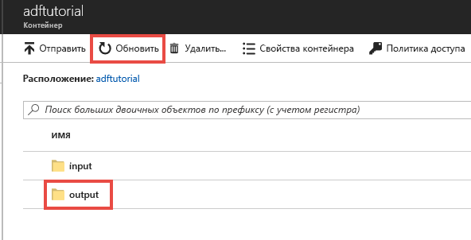
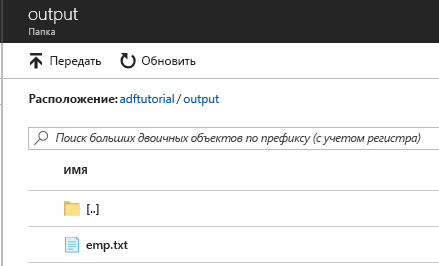

## <a name="verify-the-output"></a>Проверка выходных данных
Конвейер автоматически создает выходную папку в контейнере больших двоичных объектов adftutorial. Затем он копирует файл emp.txt из входной папки в выходную. 

1. На странице контейнера **adftutorial** на портале Azure нажмите кнопку **Обновить**, чтобы появилась папка output. 
    
    
2. Щелкните **output** в списке папок. 
2. Убедитесь, что файл **emp.txt** скопирован в папку output. 

    

## <a name="clean-up-resources"></a>Очистка ресурсов
Вы можете удалить ресурсы, созданные в ходе работы с этим руководством, двумя способами. Вы можете удалить [группу ресурсов Azure](../articles/azure-resource-manager/resource-group-overview.md), которая содержит все связанные ресурсы. Если же вы хотите сохранить другие ресурсы, удалите только фабрику данных, созданную в этом руководстве.

При удалении группы ресурсов будут удалены все входящие в нее ресурсы, включая фабрики данных. Выполните следующую команду, чтобы удалить всю группу ресурсов: 
```powershell
Remove-AzResourceGroup -ResourceGroupName $resourcegroupname
```

Примечание: удаление группы ресурсов может занять некоторое время. Наберитесь терпения.

Если вам нужно удалить только фабрику данных, а не всю группу ресурсов, выполните следующую команду: 

```powershell
Remove-AzDataFactoryV2 -Name $dataFactoryName -ResourceGroupName $resourceGroupName
```