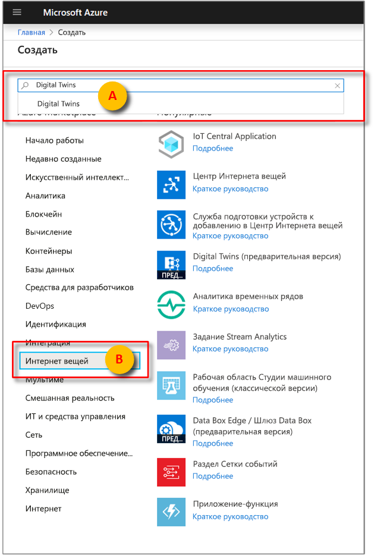
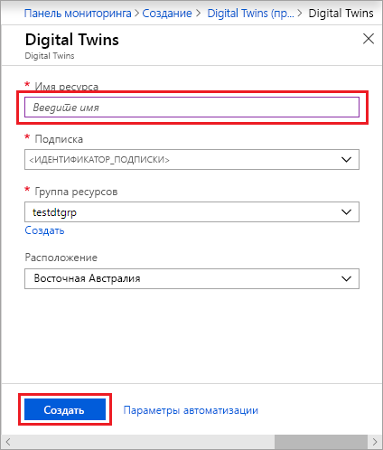
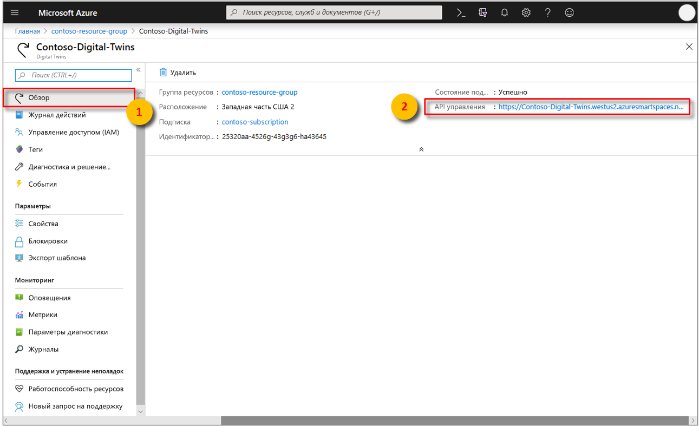

1. Войдите на [портале Azure](http://portal.azure.com).

1. В области слева выберите **Создать ресурс**. Выполните поиск по фразе **digital twins** и выберите **Digital Twins (предварительная версия)**. Нажмите кнопку **Создать**, чтобы начать развертывание.

   

1. В области **Digital Twins** введите следующие сведения:
   * **Имя ресурса**: Задайте уникальное имя для экземпляра Digital Twins.
   * **Подписка**: Выберите подписку, в которой будет создан экземпляр Digital Twins. 
   * **Группа ресурсов.** Выберите или создайте [группу ресурсов](https://docs.microsoft.com/azure/azure-resource-manager/resource-group-overview#resource-groups) для экземпляра Digital Twins.
   * **Расположение.** Выберите ближайшее к вашим устройствам расположение.

    

1. Проверьте сведения, указанные для Digital Twins, и щелкните **Создать**. Создание экземпляра Digital Twins может занять несколько минут. Ход создания можно отслеживать на панели **уведомлений**.

1. Откройте область **Общие сведения** для созданного экземпляра Digital Twins. Обратите внимание на ссылку, которая отображается под элементом **API управления**.

   URL-адрес **API управления** имеет следующий вид: `https://yourDigitalTwinsName.yourLocation.azuresmartspaces.net/management/swagger`. По этому URL-адресу находится документация по REST API для Azure Digital Twins, которая относится к созданному экземпляру. См. сведения об [использовании Azure Digital Twins ](../articles/digital-twins/how-to-use-swagger.md), чтобы получить представление о том, как изучать и применять эту документацию по API.

    Измените URL-адрес **API управления** следующим образом: `https://yourDigitalTwinsName.yourLocation.azuresmartspaces.net/management/api/v1.0/`. Этот измененный URL-адрес станет базовым адресом для доступа вашего приложения к экземпляру Digital Twins. Скопируйте измененный URL-адрес во временный файл. Этот URL-адрес понадобится вам в следующих разделах.

    