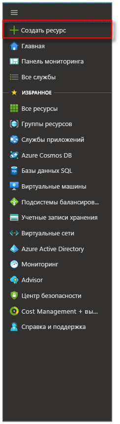
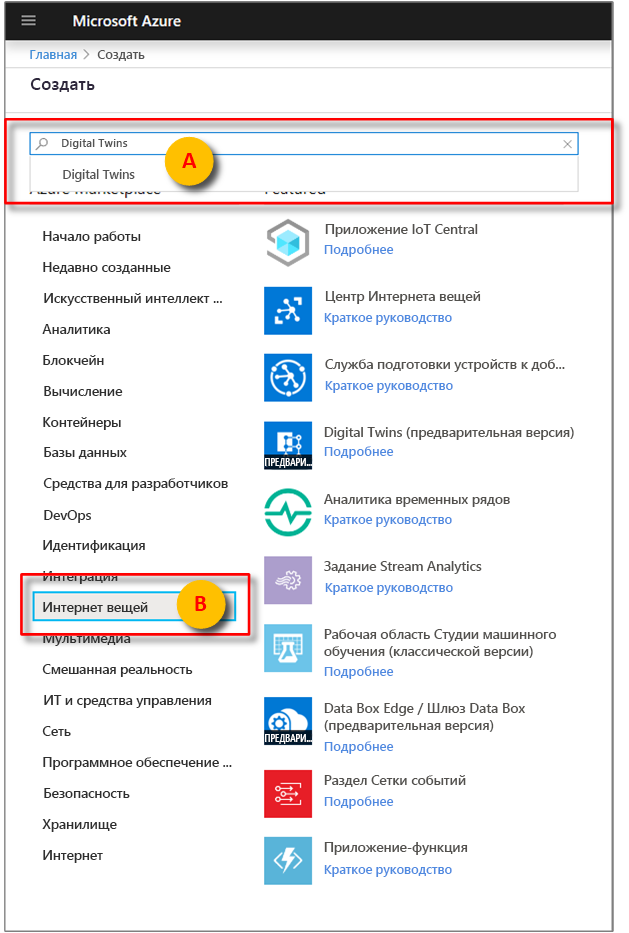
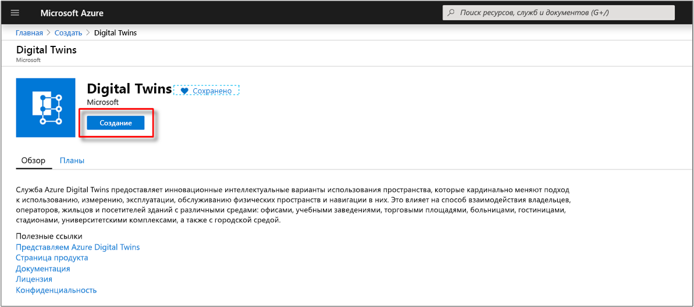

1. Войдите на [портал Azure](https://portal.azure.com).

1. На боковой панели домашней страницы выберите **+ Создать ресурс**. 

   [](./media/create-digital-twins-portal/azure-portal-create-a-resource.png#lightbox)

1. Выполните поиск по фразе **Digital Twins** и выберите **Digital Twins**. 

   [](./media/create-digital-twins-portal/azure-portal-create-digital-twins.png#lightbox)

   Кроме того, выберите **Интернет вещей**, а затем щелкните **Digital Twins (preview)** (Digital Twins (предварительная версия)).

1. Нажмите кнопку **Создать**, чтобы начать развертывание.

   [](./media/create-digital-twins-portal/azure-create-and-confirm-resource.png#lightbox)

1. В области **Digital Twins** введите следующие сведения:
   * **Имя ресурса**. Задайте уникальное имя для экземпляра Digital Twins.
   * **Подписка**. Выберите подписку, в которой будет создан экземпляр Digital Twins. 
   * **Группа ресурсов**. Выберите или создайте [группу ресурсов](https://docs.microsoft.com/azure/azure-resource-manager/resource-group-overview#resource-groups) для экземпляра Digital Twins.
   * **Расположение**. Выберите ближайшее расположение для своих устройств.

     [](./media/create-digital-twins-portal/create-digital-twins-param.png#lightbox)

1. Проверьте сведения, указанные для Digital Twins, и щелкните **Создать**. Создание экземпляра Digital Twins может занять несколько минут. Ход создания можно отслеживать на панели **уведомлений**.

1. Откройте область **Общие сведения** для созданного экземпляра Digital Twins. Обратите внимание на ссылку, которая отображается под элементом **API управления**. URL-адрес **API управления** имеет следующий вид: 
   
   ```URL
   https://yourDigitalTwinsName.yourLocation.azuresmartspaces.net/management/swagger
   ```
   
   По этому URL-адресу находится документация по REST API для Azure Digital Twins, которая относится к созданному экземпляру. См. сведения об [использовании Azure Digital Twins ](../articles/digital-twins/how-to-use-swagger.md), чтобы получить представление о том, как изучать и применять эту документацию по API. Копируйте и измените URL-адрес **API управления** следующим образом: 
    
   ```URL
   https://yourDigitalTwinsName.yourLocation.azuresmartspaces.net/management/api/v1.0/
   ```
    
   Этот измененный URL-адрес станет базовым адресом для доступа вашего приложения к экземпляру Digital Twins. Скопируйте измененный URL-адрес во временный файл. Этот URL-адрес понадобится вам в следующих разделах.

   [](./media/create-digital-twins-portal/digital-twins-management-api.png#lightbox)