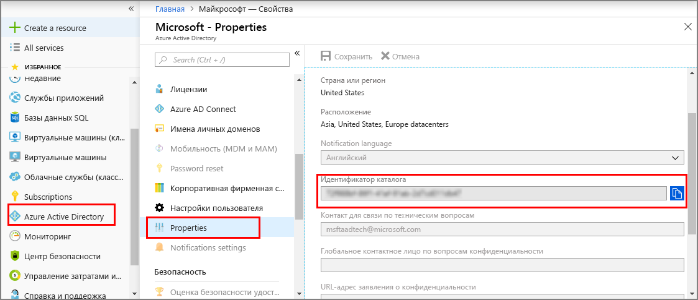

1. На [портале Azure](https://portal.azure.com) выберите **Azure Active Directory** на панели слева, а затем откройте область **Свойства**. Скопируйте **идентификатор каталога** во временный файл. Это значение будет использоваться для настройки примера приложения в следующем разделе.

    

1. Откройте область **Регистрация приложений** и нажмите кнопку **Регистрация нового приложения**.

    

1. Задайте понятное имя для этой регистрации приложения в поле **Имя**. В поле **Тип приложения** укажите **Собственное**, а в поле **URL-адрес перенаправления** — `https://microsoft.com`. Нажмите кнопку **Создать**.

    

1. Откройте зарегистрированное приложение и скопируйте значение в поле **Идентификатор приложения** во временный файл. Это значение является идентификатором приложения Azure Active Directory. Этот идентификатор будет использоваться для настройки примера приложения в следующих разделах.

    

1. Откройте панель регистрации своего приложения. Выберите **Параметры** > **Необходимые разрешения**, а затем:

   a. Слева вверху выберите **Добавить**, чтобы открыть область **Добавить доступ через API**.

   b. Нажмите кнопку **Выбрать API** и выполните поиск по запросу **Azure Digital Twins**. Если найти API не удается, выполните поиск по запросу **Azure Smart Spaces**.

   c. Выберите вариант **Azure Digital Twins (Azure Smart Spaces Service)** и нажмите кнопку **Выбрать**.

   d. Щелкните **Выбор разрешений**. Установите флажок **Доступ на чтение/запись** в разделе "Делегированные разрешения" и нажмите кнопку **Выбрать**.

   д. В области **Добавить доступ через API** щелкните **Готово**.

   Е. В области **Необходимые разрешения** выберите значок **Предоставить разрешения** и примите отобразившееся подтверждение.

      
