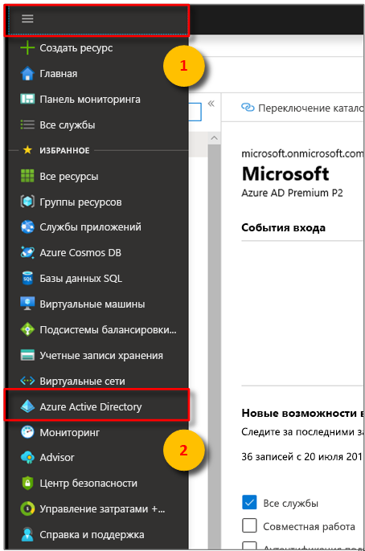
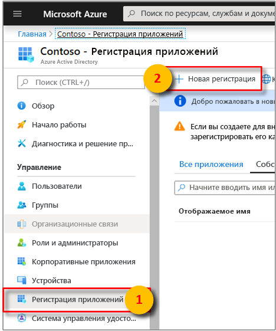
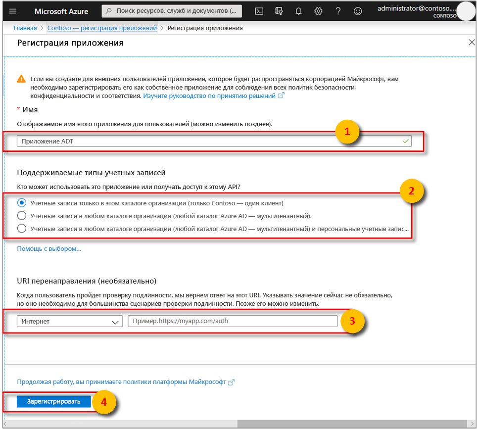
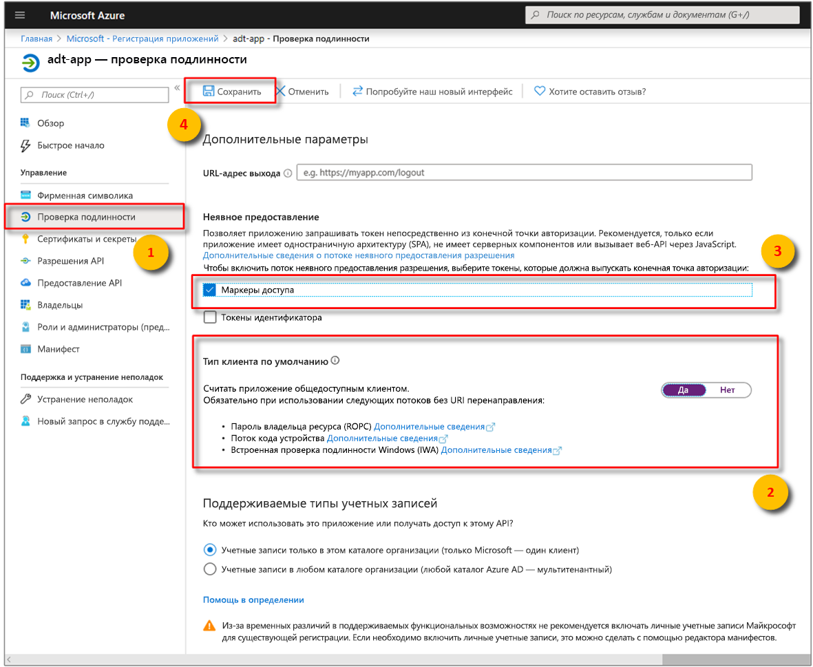

>[!NOTE]
>В этом разделе приводятся инструкции по [регистрации приложения Azure AD](https://docs.microsoft.com/azure/active-directory/develop/quickstart-register-app).

1. На [портале Azure](https://portal.azure.com) выберите **Azure Active Directory** в развертываемом меню слева, а затем откройте область **Регистрация приложений**. 

    

1. Нажмите кнопку **+ Новая регистрация**.

    

1. Задайте понятное имя для этой регистрации приложения в поле **Имя**. В разделе **URI перенаправления (необязательно)** выберите параметр **Общедоступный/собственный клиент (мобильный и классический)** в раскрывающемся меню слева и введите `https://microsoft.com` в текстовое поле справа. Выберите **Зарегистрировать**.

    

1. Чтобы убедиться, что [приложение зарегистрировано как **общедоступный клиент**](https://docs.microsoft.com/azure/active-directory/develop/scenario-desktop-app-registration), откройте область **Аутентификация** для регистрации приложения и прокрутите вниз в этой области. В разделе **Тип клиента по умолчанию** выберите **Да** для параметра **Treat application as a public client** (Рассматривать приложение как общедоступный клиент), а затем нажмите кнопку **Сохранить**.

    Установите флажок **Маркеры доступа**, чтобы включить параметр **oauth2AllowImplicitFlow** в файле Manifest.json.

    

1.  Откройте область **Обзор** зарегистрированного приложения и скопируйте значения следующих сущностей во временный файл. Эти значения будут использоваться для настройки примера приложения в следующих разделах.

    - **Application (client) ID** (Идентификатор приложения (клиент))
    - **Идентификатор каталога (клиент)**

    

1. Откройте область **Разрешения API** для регистрации приложения. Нажмите кнопку **+ Add a permission** (+ Добавить разрешение). В области **Запрос разрешений API** щелкните вкладку **Интерфейсы API, используемые моей организацией**, а затем выполните поиск по одному из следующих запросов:
    
    1. `Azure Digital Twins`. Выберите API **Azure Digital Twins**.

        

    1. Кроме того, можно выполнить поиск `Azure Smart Spaces Service`. Выберите API **Azure Smart Spaces Service**.

        

    > [!IMPORTANT]
    > Имя и идентификатор API Azure AD, которые будут отображаться, зависят от вашего клиента:
    > * Для тестовых клиентов и учетных записей клиентов следует искать `Azure Digital Twins`.
    > * Для других учетных записей Майкрософт следует искать `Azure Smart Spaces Service`.

1. Выбранный API появится как **Azure Digital Twins** в той же области **Запрос разрешений API**. Выберите параметр **Чтение** из раскрывающегося списка, а затем установите флажок **Read.Write**. Нажмите кнопку **Add permissions** (Добавить разрешения).

    

1. В зависимости от параметров вашей организации вам может потребоваться предпринять дополнительные шаги для предоставления доступа администратора к этому API. Для получения дополнительной информации обратитесь к администратору. Как только доступ администратора будет утвержден, в столбце **Admin Consent Required** (Требуется согласие администратора) в области **Разрешения API** будут отображаться ваши разрешения. 

    

    Проверьте, отображается ли **Azure Digital Twins**.
