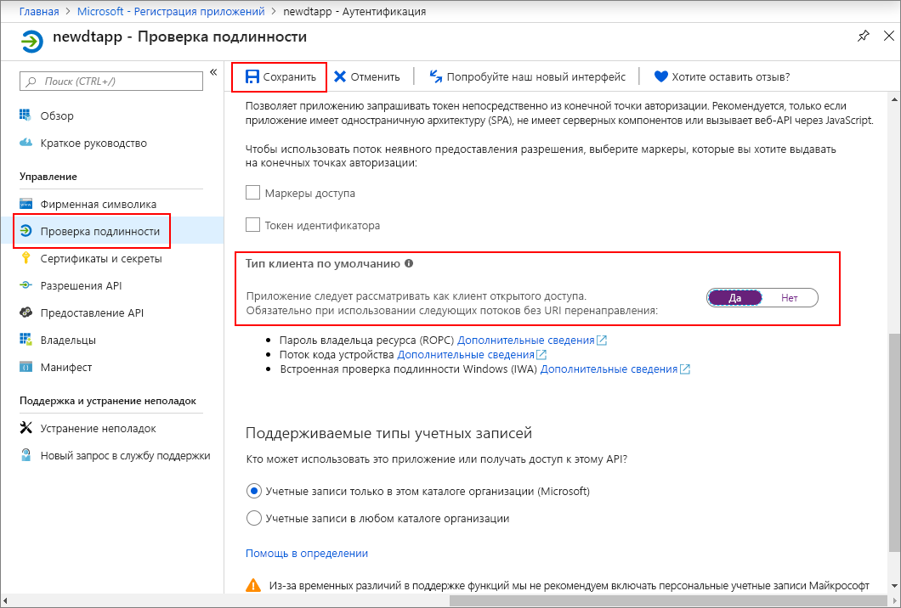

>[!NOTE]
>В этом разделе приводятся инструкции для [новой регистрации приложения Azure AD](https://docs.microsoft.com/azure/active-directory/develop/quickstart-register-app). Если у вас все еще есть прежняя регистрация собственного приложения, вы можете использовать ее, пока она поддерживается. Кроме того, если по какой-то причине новый способ регистрации приложений не работает в установке, вы можете попытаться создать прежнее собственное приложение AAD. Дополнительные инструкции см. в статье [Register your Azure Digital Twins app with Azure Active Directory legacy](../articles/digital-twins/how-to-use-legacy-aad.md) (Регистрация приложения Azure Digital Twins с помощью прежней версии Azure Active Directory). 

1. На [портале Azure](https://portal.azure.com) выберите **Azure Active Directory** на панели слева, а затем откройте область **Регистрация приложений**. Нажмите кнопку **Новая регистрация**.

    

1. Задайте понятное имя для этой регистрации приложения в поле **Имя**. В разделе **URI перенаправления (необязательно)** выберите параметр **Public client (mobile & desktop)** (Общедоступный клиент (мобильный и классический)) в раскрывающемся списке слева и введите `https://microsoft.com` в текстовое поле справа. Выберите **Зарегистрировать**.

    

1. Чтобы убедится, что [приложение зарегистрировано как *собственное приложение*](https://docs.microsoft.com/azure/active-directory/develop/scenario-desktop-app-registration), откройте область **Аутентификация** для регистрации приложения и прокрутите вниз в этой области. В разделе **Тип клиента по умолчанию** выберите **Да** для параметра **Treat application as a public client** (Рассматривать приложение как общедоступный клиент). 

    

1.  Откройте область **Обзор** зарегистрированного приложения и скопируйте значения следующих сущностей во временный файл. Эти значения будут использоваться для настройки примера приложения в следующих разделах.

    - **Application (client) ID** (Идентификатор приложения (клиент))
    - **Идентификатор каталога (клиент)**

    

1. Откройте область **Разрешения API** для регистрации приложения. Нажмите кнопку **Add a permission** (Добавить разрешение). В области **Запрос разрешений API** щелкните вкладку **Интерфейсы API, используемые моей организацией**, а затем выполните поиск по запросу **Azure Smart Spaces**. Выберите API **Azure Smart Spaces Service**.

    

1. Выбранный API появится как **Azure Digital Twins** в той же области **Запрос разрешений API**. Выберите раскрывающийся список **Read (1)** (Чтение (1)), а затем установите флажок **Read.Write**. Нажмите кнопку **Add permissions** (Добавить разрешения).

    

1. В зависимости от параметров вашей организации вам может потребоваться предпринять дополнительные шаги для предоставления доступа администратора к этому API. Для получения дополнительной информации обратитесь к администратору. Как только доступ администратора будет утвержден, столбец **ADMIN CONSENT REQUIRED** (Требуется согласие администратора) в области **Разрешения API** будет отображать примерно следующее для интерфейсов API:

    

