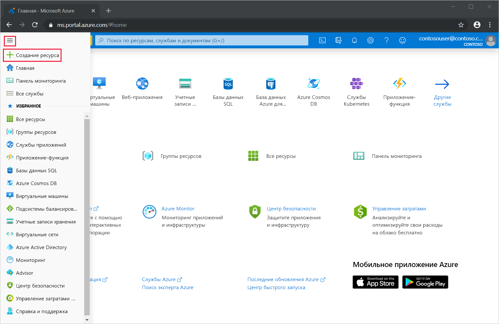
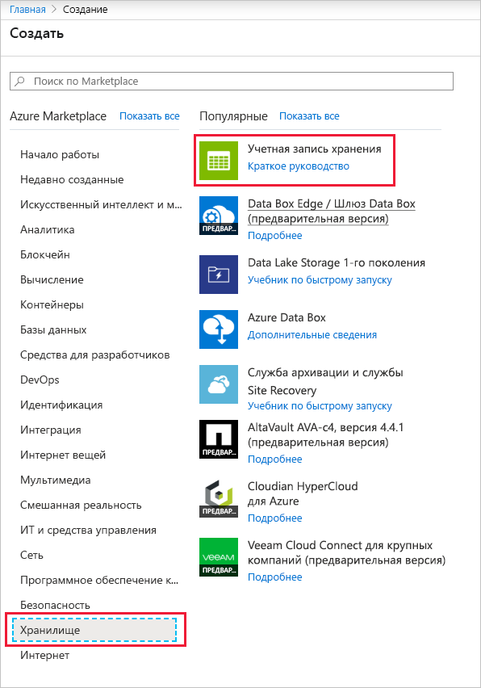
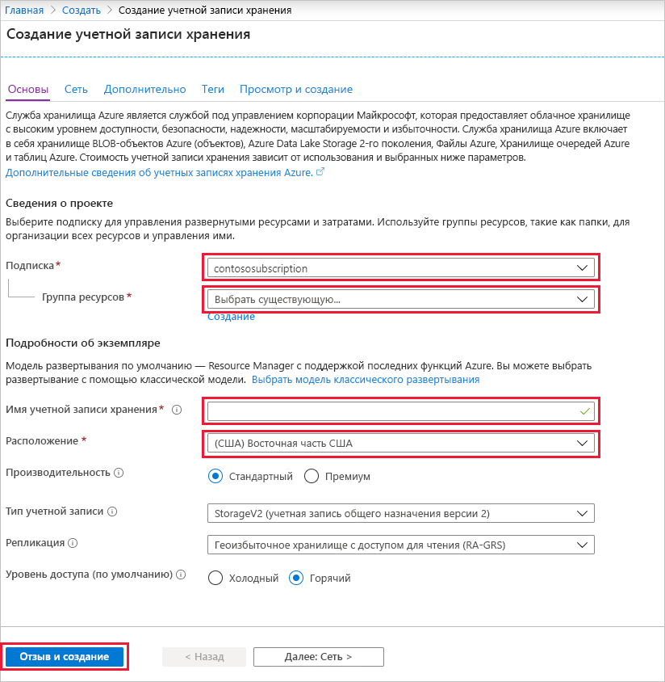
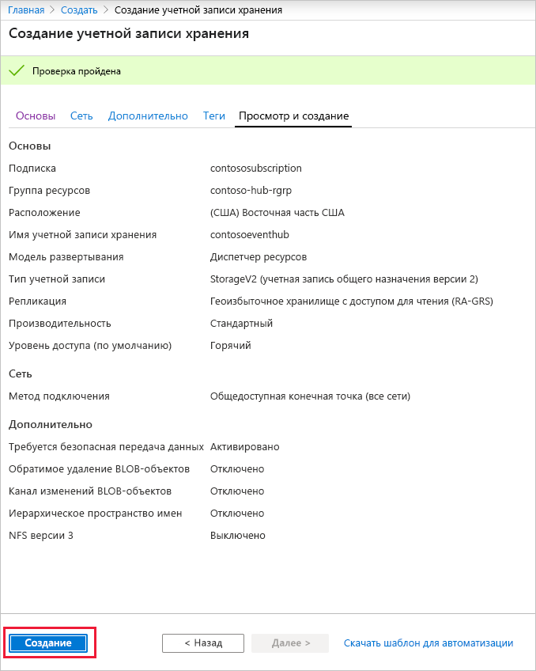
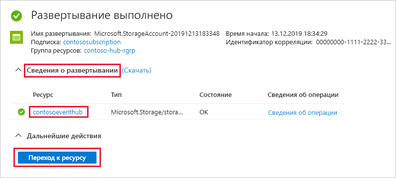
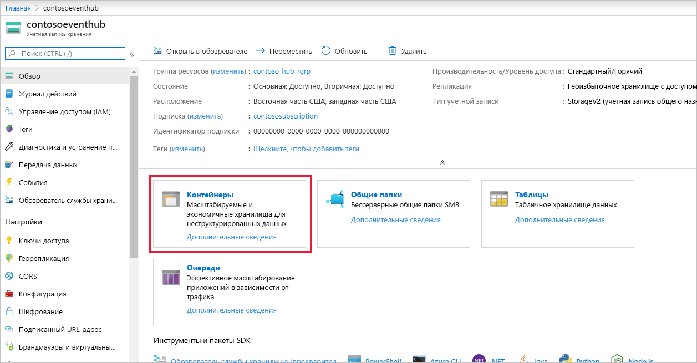
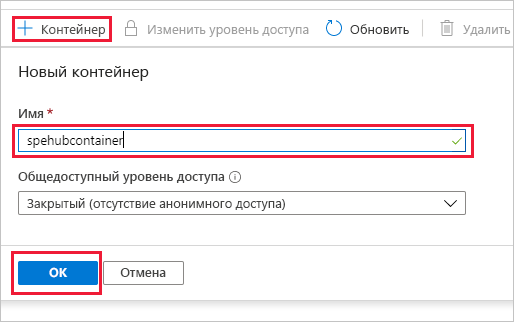

### Создание учетной записи хранения для узла обработчика событий
Узел обработчика событий представляет собой интеллектуальный агент, который упрощает прием событий от Центров событий путем управления постоянными контрольными точками и параллельным приемом. Для создания контрольных точек узлу обработчика событий требуется учетная запись хранения. В следующем примере показано, как создать учетную запись хранения и как получить ключи для доступа:

1. В меню портала Azure выберите **Создать ресурс**.

    

2. Выберите **Хранилище** > **Учетная запись хранения**.
   
    

3. На странице **Создание учетной записи хранения** выполните следующие действия: 

   1. Укажите **имя учетной записи хранения**.
   2. Выберите **подписку** Azure, содержащую концентратор событий.
   3. Выберите или создайте **группу ресурсов**, содержащую концентратор событий.
   4. Выберите **расположение** для создания ресурса. 
   5. Выберите **Review + create** (Просмотреть и создать).
   
        

4. На странице **Просмотр и создание** проверьте значения и выберите **Создать**. 

    
5. После получения уведомления **Выполненные развертывания** выберите **Перейти к ресурсу**, чтобы открыть страницу учетной записи хранения. Кроме того, вы можете развернуть **сведения о развертывании**, а затем выбрать новый ресурс в списке ресурсов.  

     
6. Выберите **Контейнеры**.

    
7. В верхней части выберите **+ Контейнер**, введите **имя** для контейнера и нажмите кнопку **ОК**. 

    
8. Выберите **Ключи доступа** на странице **Учетная запись хранения** и скопируйте значение **key1**.

    Сохраните на время указанные ниже значения в Блокноте или любом другом месте.
    - Имя учетной записи хранения
    - Доступ к учетной записи хранения
    - Имя контейнера
