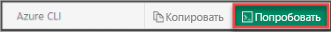

В этой статье используются командлеты PowerShell. Для запуска командлетов, можно использовать Azure Cloud Shell, интерактивную оболочку среды размещенная в Azure и использующаяся через браузер. Azure Cloud Shell поставляется с предустановленным командлетов Azure PowerShell.

Для выполнения любого кода, содержащихся в этой статье на Azure Cloud Shell, откройте сеанс Cloud Shell, используйте **копирования** кнопки в блоке кода, скопируйте код и вставьте его в сеанс Cloud Shell с __Ctrl + Shift + V__ на Windows и Linux, или __Cmd + Shift + V__ в macOS. Вставленный текст не выполняется автоматически, поэтому нажмите клавишу **ввод** для выполнения кода.

Вы можете запустить Azure Cloud Shell с помощью:

|  |   |
|-----------------------------------------------|---|
| Нажмите кнопку **Попробовать** в правом верхнем углу блока с кодом. Это __не__ автоматически скопировать текст в Cloud Shell. |  |
| Откройте [shell.azure.com](https://shell.azure.com) в браузере. |  |
| Нажмите кнопку меню **Cloud Shell** в правом верхнем углу окна [портала Azure](https://portal.azure.com). |  |

Если вы не хотите использовать Azure Cloud Shell, установите Azure PowerShell локально вместо этого. Не забудьте установить последнюю версию модуля Az Azure PowerShell, чтобы получить актуальные функции. Дополнительные сведения см. в статье [Установка Azure PowerShell](/powershell/azure/overview).
