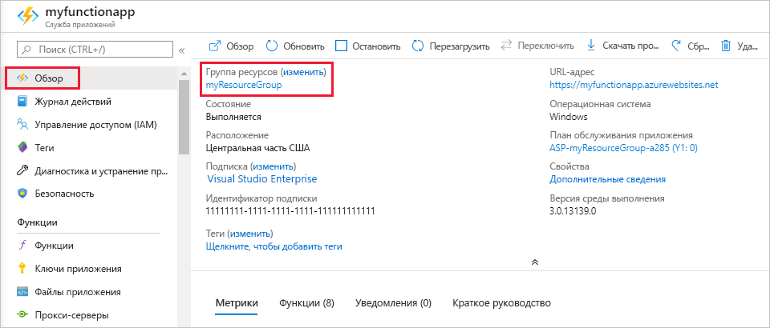

1. В Visual Studio Code нажмите клавишу F1, чтобы открыть палитру команд. В палитре команд найдите и щелкните `Azure Functions: Open in portal`.

1. Выберите приложение-функцию и нажмите клавишу ВВОД. Страница приложения функции откроется на [портале Azure](https://portal.azure.com).

1. На вкладке **Обзор** выберите именованную ссылку в разделе **Группа ресурсов**.

    

1. На странице **Resource group** (Группа ресурсов) просмотрите список включенных ресурсов и убедитесь, что именно их требуется удалить.
 
1. Выберите **Удалить группу ресурсов** и следуйте инструкциям.

   Удаление может занять несколько минут. После этого на несколько секунд появится уведомление. Кроме того, можно выбрать значок колокольчика в верхней части страницы, чтобы просмотреть уведомление.