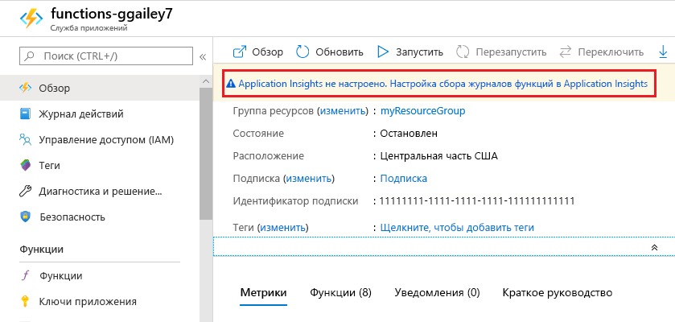
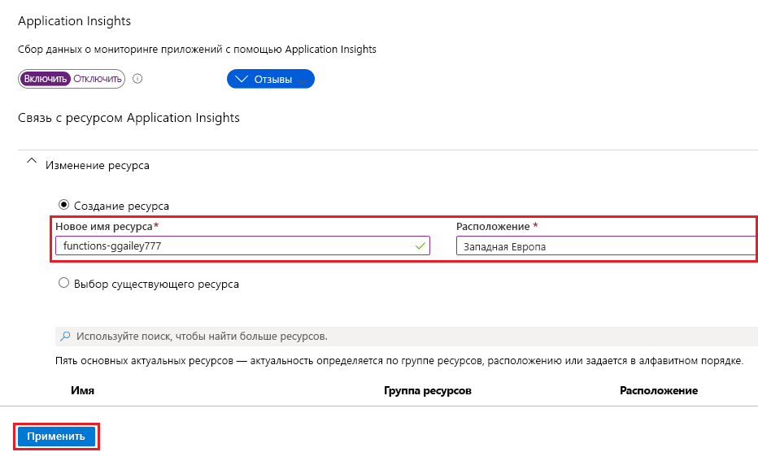

Функции упрощают добавление возможностей интеграции Application Insights в приложение-функцию на [портале Azure].

1. На [портале][Azure] выберите **Все службы > Приложения-функции**. Выберите приложение-функцию и щелкните баннер **Application Insights** в верхней части окна.

    

1. Создайте ресурс Application Insights с помощью параметров, указанных в таблице под рисунком.

   

    | Параметр      | Рекомендуемое значение  | ОПИСАНИЕ                                        |
    | ------------ |  ------- | -------------------------------------------------- |
    | **ИМЯ** | Уникальное имя приложения | Проще всего использовать имя приложения-функции, которое должно быть уникальным в вашей подписке. | 
    | **Расположение** | Западная Европа | Если возможно, используйте [регион](https://azure.microsoft.com/regions/) приложения-функции или ближайший от него. |

1. Нажмите кнопку **ОК**. Ресурс Application Insights создается в той же группе ресурсов и подписке, что и приложение-функция. После завершения создания закройте окно Application Insights.

1. В приложении-функции выберите **Параметры приложения** и прокрутите окно вниз до раздела **Параметры приложения**. Когда появится параметр `APPINSIGHTS_INSTRUMENTATIONKEY`, это означает, что для приложения-функции в Azure включена интеграция с Application Insights.

[Портал Azure]: https://portal.azure.com
