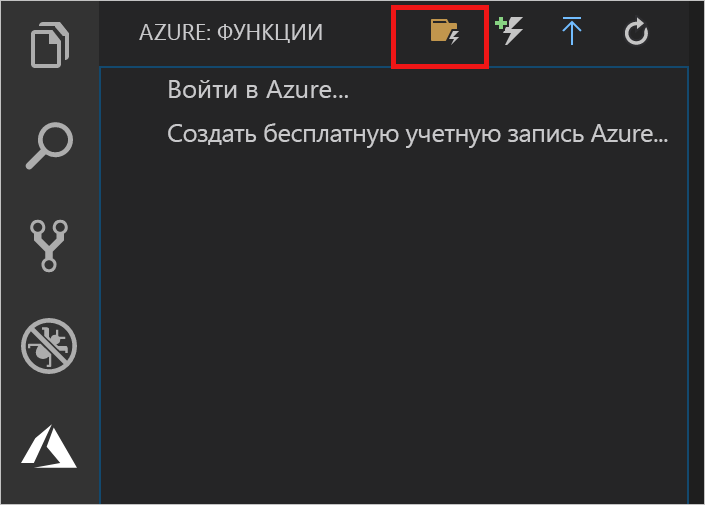
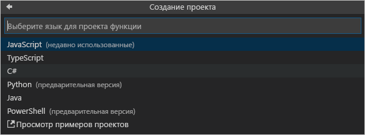

## Создание проекта Функций Azure

С помощью шаблона проекта Функции Azure в Visual Studio Code можно создать проект и затем опубликовать его в виде приложения-функции в Azure. Приложение-функция позволяет группировать функции в логические единицы для развертывания и совместного использования ресурсов, а также управления ими.

1. В Visual Studio Code выберите логотип Azure, чтобы отобразить область **Функций Azure**, а затем нажмите значок "Создать новый проект".

    

1. Выберите расположение для рабочей области проекта и нажмите **Select** (Выбрать).

    > [!NOTE]
    > Рассматриваемый в этой статье пример выполняется вне рабочей области. В этом случае не нужно указывать папку проекта, которая является частью рабочей области.

1. Выберите язык для проекта приложения-функции. В этом примере используется JavaScript.
    

1. Когда появится запрос, выберите **Add to workspace** (Добавить в рабочую область).

Редактор Visual Studio Code создаст проект приложения-функции в новой рабочей области. Проект будет содержать файлы конфигурации [host.json](../articles/azure-functions/functions-host-json.md) и [local.settings.json](../articles/azure-functions/functions-run-local.md#local-settings-file), а также файлы проекта для указанного языка. В папке проекта также появится новый репозиторий Git.