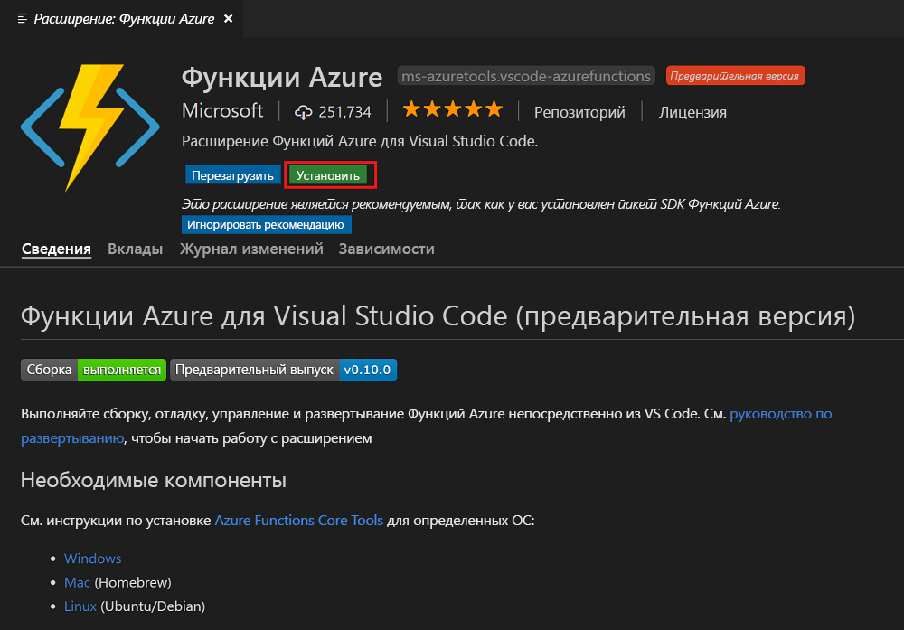
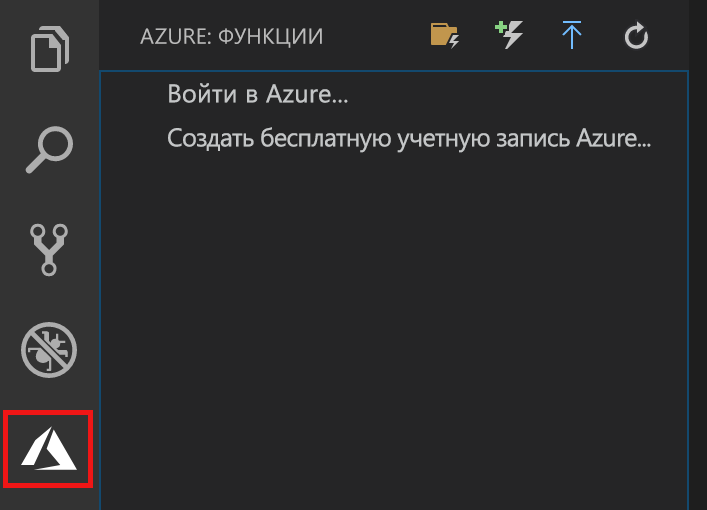

## Установка расширения "Функции Azure"

Расширение "Функции Azure" предназначено для создания, тестирования и развертывания функций в Azure.

1. В Visual Studio Code откройте **Extensions** (Расширения) и найдите `azure functions` или [перейдите по этой ссылке](vscode:extension/ms-azuretools.vscode-azurefunctions).

1. Выберите **Install** (Установить), чтобы установить расширение для Visual Studio Code.

    

1. Перезапустите Visual Studio Code и щелкните значок Azure на панели действий. Вы увидите область Azure Functions (Функции Azure) на боковой панели.

    