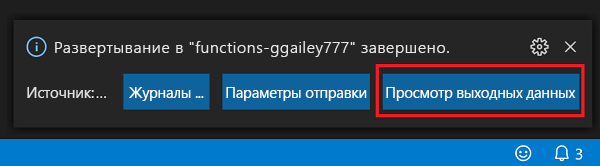
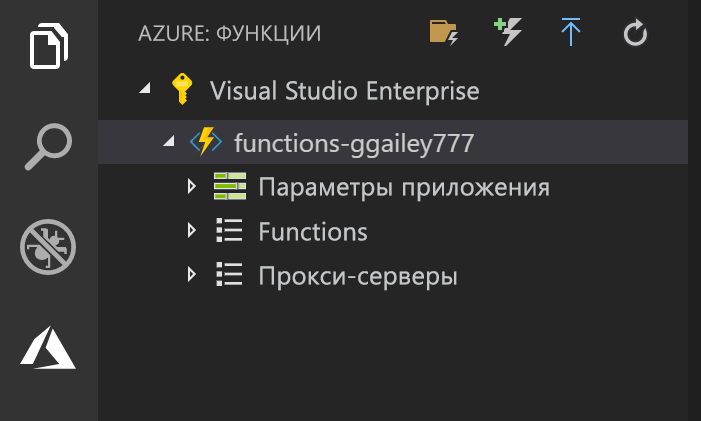

## Публикация проекта в Azure

Visual Studio Code позволяет опубликовать проект функций непосредственно в Azure. При этом вы создаете приложение-функцию и связанные ресурсы в своей подписке Azure. Приложение-функция обеспечивает контекст выполнения функций. Проект упаковывается и развертывается в новом приложении-функции в вашей подписке Azure. 

В этой статье предполагается, что вы создаете новое приложение-функцию. Публикация в существующее приложение-функцию перезаписывает содержимое этого приложения в Azure.

1. В области **Azure: Functions** ( Azure: Функции) щелкните значок Deploy to Function App (Развернуть в приложение-функцию).

    

1. Выберите папку проекта, которая является текущей рабочей областью.

1. Если у вас есть несколько подписок, выберите ту, в которой будет размещено приложение-функция, после чего щелкните **+Create New Function App** (Создать приложение-функцию).

1. Введите глобальное уникальное имя для приложения-функции и нажмите клавишу ВВОД. Допустимые символы для имени приложения-функции: `a-z`, `0-9` и `-`.

1. Выберите **+Create New Resource Group** (Создать группу ресурсов), назначьте глобальное уникальное имя группе ресурсов, например `myResourceGroup`, и нажмите клавишу ВВОД. Вы также можете использовать существующую группу ресурсов.

1. Выберите **+ Создать учетную запись хранения**, введите глобальное уникальное имя группы ресурсов для вашего приложения-функции и нажмите клавишу ВВОД. Имя учетной записи хранения должно содержать от 3 до 24 символов и состоять только из цифр и строчных букв. Вы также можете использовать имеющуюся учетную запись.

1. Выберите расположение в ближайшем к вам [регионе](https://azure.microsoft.com/regions/) или регионе, ближайшем к другим службам, к которым обращаются ваши функции.

    После того как вы укажете расположение, начнется создание приложения-функции. После создания приложения-функции и применения пакета развертывания отобразится уведомление.

1. Выберите **View Output** (Просмотреть выходные данные) в уведомлении, чтобы просмотреть результаты создания и развертывания ресурсов Azure.

    

1. Запишите URL-адрес нового приложения-функции в Azure. Он понадобится для тестирования функции после публикации проекта в Azure.

    

1. В области **Azure: Functions** (Azure: Функции) вы увидите новое приложение-функцию, появившееся в вашей подписке. Если развернуть этот узел, отобразятся функции в приложении-функции, а также параметры приложения и прокси-серверы функций.

    

    В узле приложения-функции нажмите клавишу CTRL и щелкните правой кнопкой мыши, чтобы отобразить список доступных задач по управлению и настройке приложения-функции в Azure. Приложение-функцию можно также просмотреть на портале Azure.
