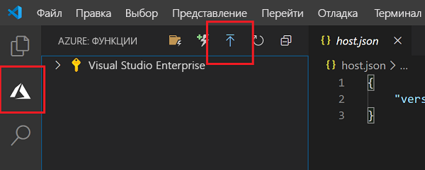
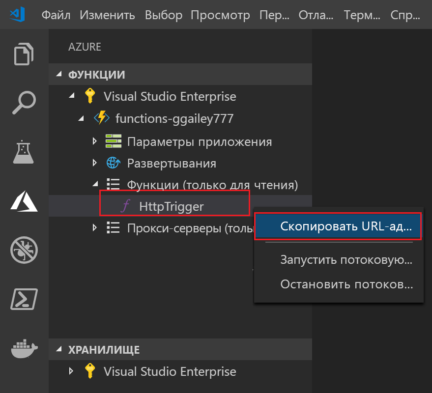

## Публикация проекта в Azure

Visual Studio Code позволяет опубликовать проект функций непосредственно в Azure. При этом вы создаете приложение-функцию и связанные ресурсы в своей подписке Azure. Приложение-функция обеспечивает контекст выполнения функций. Проект упаковывается и развертывается в новом приложении-функции в вашей подписке Azure.

В этой статье предполагается, что вы создаете новое приложение-функцию. 

> [!IMPORTANT]
> Публикация в существующее приложение-функцию перезаписывает содержимое этого приложения в Azure.

1. В области **Azure: Functions** (Azure: Функции) щелкните значок Deploy to Function App (Развернуть в приложение-функцию).

    

1. Если вы не вошли в систему, вам будет предложено **Войти в Azure**. Вы также можете выбрать **Создать бесплатную учетную запись Azure**. После успешного входа из браузера вернитесь в Visual Studio Code. 

1. Если у вас несколько подписок, щелкните **Выберите подписку** для приложения-функции, затем выберите **+ Создать новое приложение-функцию в Azure**.

1. Введите глобальное уникальное имя для приложения-функции и нажмите клавишу ВВОД. Допустимые символы для имени приложения-функции: `a-z`, `0-9` и `-`.

1. Выберите **+Create New Resource Group** (Создать группу ресурсов), назначьте глобальное уникальное имя группе ресурсов, например `myResourceGroup`, и нажмите клавишу ВВОД. Вы также можете использовать существующую группу ресурсов.

1. Выберите **+ Создать учетную запись хранения**, введите глобальное уникальное имя группы ресурсов для вашего приложения-функции и нажмите клавишу ВВОД. Имя учетной записи хранения должно содержать от 3 до 24 символов и состоять только из цифр и строчных букв. Вы также можете использовать имеющуюся учетную запись.

1. Выберите расположение в ближайшем к вам [регионе](https://azure.microsoft.com/regions/) или регионе, ближайшем к другим службам, к которым обращаются ваши функции.

    При нажатии клавиши ВВОД в Azure в вашей подписке создаются следующие ресурсы:

    * **[Группа ресурсов](../articles/azure-resource-manager/resource-group-overview.md)** . Содержит все созданные ресурсы Azure. Имя основывается на имени приложения-функции.
    * **[Учетная запись хранения](../articles/storage/common/storage-quickstart-create-account.md)** . Стандартная учетная запись хранения создается с уникальным именем, основанным на имени приложения-функции.
    * **[План размещения](../articles/azure-functions/functions-scale.md)** . План потребления создается в регионе "Западная часть США" для размещения бессерверного приложения-функции.
    * **Приложение-функция**. Проект развертывается и выполняется в этом новом приложении-функции.

    После создания приложения-функции и применения пакета развертывания отобразится уведомление. Выберите **View Output** (Просмотреть выходные данные) в уведомлении, чтобы просмотреть результаты создания и развертывания ресурсов Azure.

1. Вернитесь в область **Azure: Functions** (Azure: Функции) и откройте новое приложение-функцию в своей подписке. Разверните раздел **Функции**, щелкните правой кнопкой мыши элемент **HttpTrigger**, а затем выберите команду **Copy function URL** (Скопировать URL-адрес функции).

    
