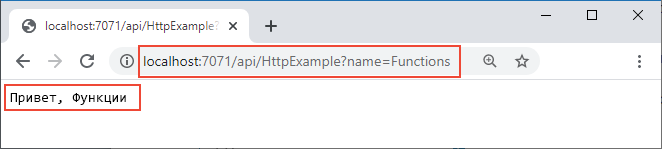

## <a name="run-the-function-locally"></a>Локальное выполнение функции

Выполните функцию, запустив локальное хост-приложение среды выполнения Функций Azure из папки *LocalFunctionProj*:

::: zone pivot="programming-language-csharp,programming-language-powershell,programming-language-javascript,programming-language-python"
```
func start
```
::: zone-end

::: zone pivot="programming-language-typescript"
```
npm install
npm start
```
::: zone-end

::: zone pivot="programming-language-java"
```
mvn clean package 
mvn azure-functions:run
```
::: zone-end

Ближе к концу выходных данных появятся следующие строки: 

<pre>
...

Now listening on: http://0.0.0.0:7071
Application started. Press Ctrl+C to shut down.

Http Functions:

        HttpExample: [GET,POST] http://localhost:7071/api/HttpExample
...

</pre>

>[!NOTE]  
> Если результат HttpExample не похож на пример ниже, скорее всего, вы запустили хост-приложение из папки, отличной от корневой папки проекта. В этом случае остановите хост-приложение клавишами **CTRL**+**C**, перейдите в корневую папку проекта и снова выполните указанную выше команду.

Скопируйте URL-адрес функции `HttpExample` из этих выходных данных в браузер и добавьте строку запроса `?name=<your-name>`, сформировав полный URL-адрес, например `http://localhost:7071/api/HttpExample?name=Functions`. В браузере должно отобразиться сообщение, например `Hello Functions`:



Терминал, в котором вы запустили проект, также выводит данные журнала при выполнении запросов.

Когда все будет готово, нажмите клавиши **Ctrl**+**C** и выберите `y`, чтобы отключить хост-приложение функции.