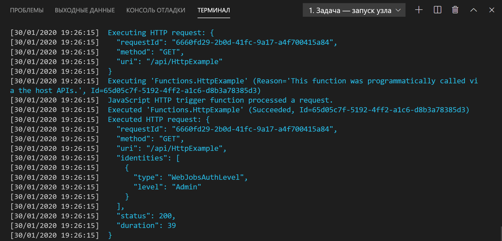

## <a name="run-the-function-locally"></a>Локальное выполнение функции

Основные инструменты Функций Azure интегрируются с Visual Studio Code, что дает возможность запускать и отлаживать проект Функций Azure локально. Инструкции по отладке с помощью Visual Studio Code см. в [этой статье](../articles/azure-functions/functions-debug-powershell-local.md). 

1. Нажмите клавишу F5, чтобы запустить проект приложения-функции. Выходные данные основных инструментов отображаются на панели **Terminal** (Терминал).

1. На панели **Terminal** (Терминал) скопируйте URL-адрес конечной точки функции, активируемой HTTP-запросом.

    

1. Добавьте строку запроса `?name=<yourname>` к этому URL-адресу, а затем используйте `Invoke-RestMethod` во второй командной строке PowerShell, чтобы выполнить запрос, пример показано ниже.

    ```powershell
    PS > Invoke-RestMethod -Method Get -Uri http://localhost:7071/api/HttpTrigger?name=PowerShell
    Hello PowerShell
    ```

    Вы также можете выполнить запрос GET в браузере по следующему URL-адресу:

    `http://localhost:7071/api/HttpExample?name=PowerShell`

    Когда вы вызываете конечную точку HttpTrigger, не передавая `name` в качестве параметра запроса или в тексте, функция возвращает ошибку `BadRequest`. Когда вы просматриваете код в run.ps1, вы поймете, что эта ошибка возникла намеренно.

1. Сведения о запросе отображаются на панели **Терминал**.

    

1. Чтобы остановить работу Core Tools, нажмите сочетание клавиш **CTRL+C**.

Убедившись, что функция выполняется правильно на локальном компьютере, опубликуйте проект в Azure.