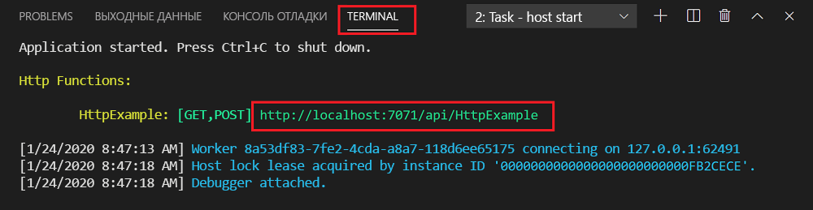
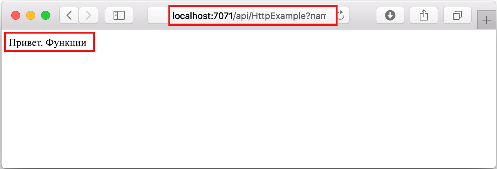

## Локальное выполнение функции

Основные инструменты службы "Функции Azure" позволяют запускать проекты функций Azure на локальном компьютере разработчика.

1. Чтобы протестировать созданную функцию, установите точку останова в коде функции и нажмите клавишу F5 для запуска проекта приложения-функции. Выходные данные основных инструментов отображаются на панели **Terminal** (Терминал).

1. На панели **Terminal** (Терминал) скопируйте URL-адрес конечной точки функции, активируемой HTTP-запросом. Этот URL-адрес содержит ключ функции, который передается в параметр запроса `code`.

    

1. Вставьте URL-адрес запроса в адресную строку браузера. Добавьте строку запроса `?name=<yourname>` в этот URL-адрес и выполните запрос. Выполнение функции приостановится при достижении точки останова.

1. При продолжении выполнения функции в браузере отобразится следующий ответ на запрос GET:

    

1. Нажмите клавиши SHIFT+F5, чтобы остановить отладку.