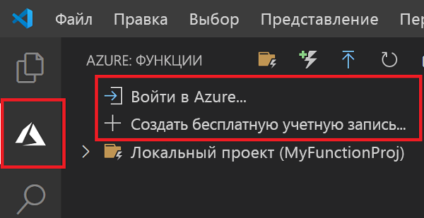

## Вход в Azure

Прежде чем публиковать приложение, необходимо войти в Azure.

1. В области **Azure: Функции** выберите **Войти в Azure**. Если у вас нет учетной записи, можно создать **бесплатную учетную запись Azure**.

    

1. При появлении запроса выберите **Copy & Open** (Копировать и открыть) или скопируйте отображаемый код и откройте <https://aka.ms/devicelogin> в браузере.

1. Скопированный код вставьте на странице **Device Login** (Вход на устройство), проверьте, выполнен ли вход в Visual Studio Code, и щелкните **Continue** (Продолжить).  

1. Войдите в учетную запись, используя учетные данные Azure. Выполнив вход, можно закрыть браузер.
