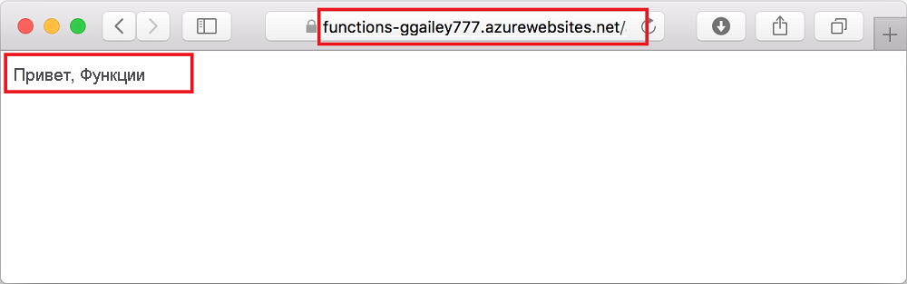

## <a name="run-the-function-in-azure"></a>Запуск функции в Azure

1. Вернитесь в область **Azure: Functions** (Azure: Функции) на панели слева и откройте новое приложение-функцию в своей подписке. Разверните **Функции** , щелкните правой кнопкой мыши (Windows) или щелкните, нажав клавишу <kbd>CTRL</kbd> (macOS), элемент **HttpExample** , а затем выберите команду **Copy function URL** (Копировать URL-адрес функции).

    

1. Вставьте этот URL-адрес для HTTP-запроса в адресную строку браузера, добавьте строку запроса `name` в качестве `?name=Functions` в конец этого URL-адреса, а затем выполните запрос. URL-адрес для вызова функции, активируемой HTTP-запросом, должен быть указан в таком формате:

    ```http
    http://<FUNCTION_APP_NAME>.azurewebsites.net/api/httpexample?name=Functions
    ```

    В примере ниже показан ответ в браузере на удаленный запрос GET, возвращаемый функцией:

    
