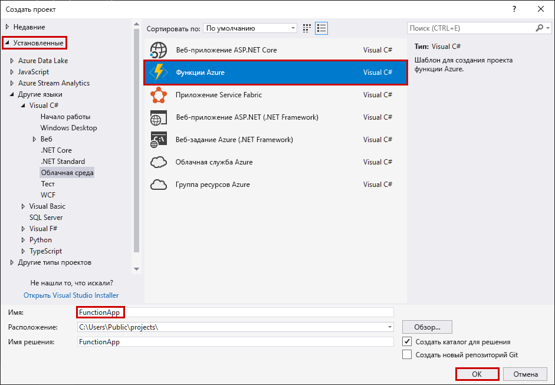
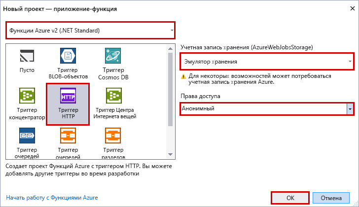

С помощью шаблона проекта функций Azure в Visual Studio можно создать проект, который затем можно опубликовать в приложении-функции в Azure. Вы можете использовать приложение-функцию, чтобы группировать функции в логические единицы для развертывания и совместного использования ресурсов, а также управления ими.

1. В Visual Studio в меню **Файл** выберите пункты **Создать** > **Проект**.

2. В диалоговом окне **Новый проект** выберите **Установлено** > **Visual C#** > **Облако** > **Функции Azure**. Введите имя проекта и нажмите кнопку **ОК**. Имя приложения-функции должно быть допустимым в качестве пространства имен C#, поэтому не используйте символы подчеркивания, дефисы и другие символы, не являющиеся буквенно-цифровыми.

    

3. Используйте настройки, указанные в таблице под изображением.

     

    | Параметр      | Рекомендуемое значение  | ОПИСАНИЕ                      |
    | ------------ |  ------- |----------------------------------------- |
    | **Версия** | Функции Azure 2.x  (.NET Core) | Этот параметр создает проект функции, использующий среду выполнения Функций Azure версии 2.x, которая поддерживает .NET Core. Функции Azure 1.x поддерживают .NET Framework. Дополнительные сведения см. в статье [Azure Functions runtime versions overview](../articles/azure-functions/functions-versions.md) (Общие сведения о версиях среды выполнения Функций Azure).   |
    | **Шаблон** | Триггер HTTP | Этот параметр создает функцию, которая активируется с помощью HTTP-запроса. |
    | **Учетная запись хранения**  | Эмулятор хранилища | Триггер HTTP не использует подключение к учетной записи службы хранилища Azure. Для всех триггеров других типов требуется допустимая строка подключения к учетной записи хранения. |
    | **Права доступа** | Анонимные | Создаваемую функцию может активировать любой клиент без указания ключа. Этот параметр авторизации позволяет легко тестировать новые функции. Дополнительные сведения о ключах и авторизации см. в разделе [Ключи авторизации](../articles/azure-functions/functions-bindings-http-webhook.md#authorization-keys) статьи [Привязки HTTP и webhook в функциях Azure](../articles/azure-functions/functions-bindings-http-webhook.md). |
    
    > [!NOTE]
    > Убедитесь, что для **прав доступа** установлено значение `Anonymous`. Если вы выберете для `Function` уровень по умолчанию, вы должны указать [функциональную клавишу](../articles/azure-functions/functions-bindings-http-webhook.md#authorization-keys) в запросах на доступ к конечной точке функции.
    
4. Нажмите кнопку **ОК**, чтобы создать проект функции и функцию, активируемую с помощью HTTP.
