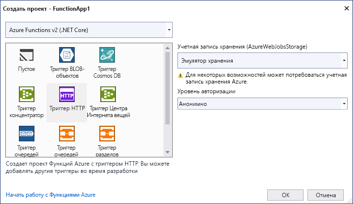

С помощью шаблона проекта Функций Azure в Visual Studio можно создать проект, а затем опубликовать его в приложении-функции в Azure. Приложение-функция позволяет группировать функции в логические единицы и упростить развертывание, масштабирование и совместное использование ресурсов, а также управление ими.

1. В строке меню Visual Studio выберите **Файл** > **Создать** > **Проект**.

1. В разделе **Создать новый проект** введите в поле поиска слово *функции*, выберите шаблон **Функции Azure**, а затем нажмите кнопку **Далее**.

1. В разделе **Настроить новый проект** введите **имя проекта**, а затем выберите команду **Создать**. Имя приложения-функции должно быть допустимым в качестве пространства имен C#, поэтому не используйте символы подчеркивания, дефисы и другие символы, не являющиеся буквенно-цифровыми.

1. Для параметров в области **Создание нового приложения Функций Azure** используйте значения, указанные в таблице ниже.

    | Параметр      | Значение  | Описание                      |
    | ------------ |  ------- |----------------------------------------- |
    | **Functions runtime** (Среда выполнения функций) | **Функции Azure v3  (.NET Core)** | С помощью этого значения создается проект функции, использующий среду выполнения Функций Azure версии 3.x, которая поддерживает .NET Core 3.x. Функции Azure 1.x поддерживают .NET Framework. Дополнительные сведения см. в [обзоре версий среды выполнения Функций Azure](../articles/azure-functions/functions-versions.md).   |
    | **Function template** (Шаблон функции) | **триггером HTTP** | С помощью этого значения создается функция, которая активируется с помощью HTTP-запроса. |
    | **Учетная запись хранения (AzureWebJobsStorage)**  | **Эмулятор хранения** | Так как для функции Azure требуется учетная запись хранения, она назначается или создается при публикации проекта в Azure. При активации с помощью HTTP-запроса не используется строка подключения учетной записи хранения Azure. Для всех остальных типов активации требуется допустимая строка подключения к учетной записи хранения Azure.  |
    | **Уровень авторизации** | **Анонимный** | Создаваемую функцию может активировать любой клиент без указания ключа. Этот параметр авторизации позволяет легко тестировать новые функции. Дополнительные сведения о ключах и авторизации см. в разделе [Ключи авторизации](../articles/azure-functions/functions-bindings-http-webhook-trigger.md#authorization-keys), а также в [обзоре привязок HTTP и веб-перехватчика](../articles/azure-functions/functions-bindings-http-webhook.md). |
    
    
    

    Убедитесь, что для параметра **Уровень авторизации** задано значение **Анонимно**. Если вы выберете для **функции** уровень по умолчанию, нужно указать [функциональную клавишу](../articles/azure-functions/functions-bindings-http-webhook-trigger.md#authorization-keys) в запросах на доступ к конечной точке функции.

1. Нажмите кнопку **Создать**, чтобы создать проект функции и функцию, активируемую с помощью HTTP.
