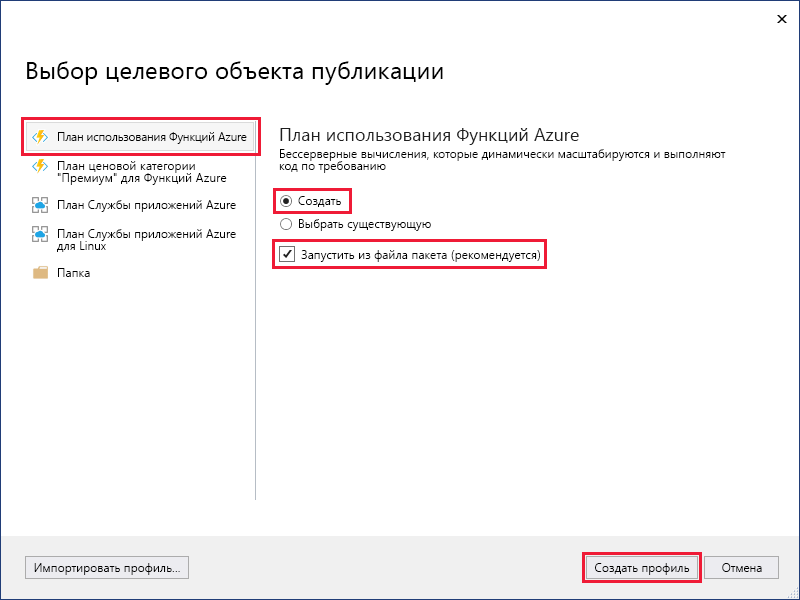
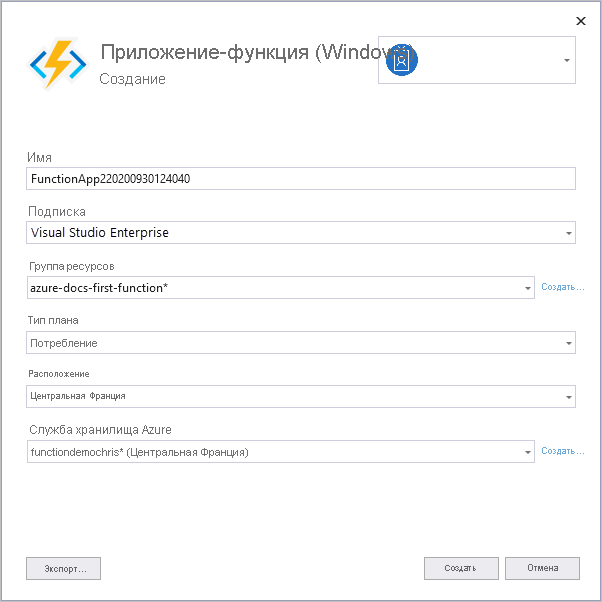

1. Щелкните правой кнопкой мыши проект в **обозревателе решений** и выберите пункт **Опубликовать**.

2. В диалоговом окне **Выберите целевой объект публикации** используйте параметры публикации, указанные в таблице под изображением. 

    

    | Параметр      | Description                                |
    | ------------ |  -------------------------------------------------- |
    | **План потребления службы "Функции Azure"** |   При публикации проекта в приложении-функции, которое работает в [плане потребления](../articles/azure-functions/functions-scale.md#consumption-plan), вы платите только за выполнение приложения-функции. Другие планы размещения связаны с дополнительными расходами. Дополнительные сведения см. в статье [Масштабирование и размещение Функций Azure](../articles/azure-functions/functions-scale.md). | 
    | **Создать** | В Azure создается приложение-функция со связанными ресурсами. Если выбрать параметр **Выбрать существующее**, все файлы в существующем приложении-функции в Azure будут перезаписаны файлами из локального проекта. Используйте этот параметр только при повторной публикации обновлений для существующего приложения-функции. |
    | **Запустить из файла пакета** | Приложение-функция развертывается с помощью [Zip Deploy](../articles/azure-functions/functions-deployment-technologies.md#zip-deploy) с включенным режимом [Run-From-Package](../articles/azure-functions/run-functions-from-deployment-package.md) (Выполнение из пакета). Этот способ повышает производительность приложения-функции и является рекомендуемым. Если этот параметр не используется, перед публикацией в Azure остановите локальное выполнение проекта приложения-функции. |

3. Нажмите кнопку **Опубликовать**. Если вы еще не вошли в учетную запись Azure из Visual Studio, выберите **Вход**. Вы также можете создать бесплатную учетную запись Azure.

4. В **Службе приложений Azure: создание** укажите параметры **размещения**, которые приведены в таблице ниже:

    

    | Параметр      | Рекомендуемое значение  | Description                                |
    | ------------ |  ------- | -------------------------------------------------- |
    | **Название** | Глобально уникальное имя | Имя, которое однозначно идентифицирует новое приложение-функцию. Допустимые символы: `a-z`, `0-9` и `-`. |
    | **подписка** | Выберите свою подписку | Подписка Azure, которую нужно использовать. |
    | **[Группа ресурсов](../articles/azure-resource-manager/resource-group-overview.md)** | myResourceGroup |  Имя группы ресурсов, в которой создается приложение-функция. Чтобы создать группу ресурсов, выберите **Создать**.|
    | **[План размещения](../articles/azure-functions/functions-scale.md)** | План потребления | Для создания бессерверного плана щелкните **Создать**, а затем выберите **Потребление** в разделе **Размер**. Также нужно выбрать **расположение** в ближайшем [регионе](https://azure.microsoft.com/regions/) или в регионе, расположенном рядом с другими службами, к которым обращаются ваши функции. Когда выполняется план, отличный от **Потребление**, необходимо будет управлять [масштабированием приложения-функции](../articles/azure-functions/functions-scale.md).  |
    | **[Служба хранилища Azure](../articles/storage/common/storage-quickstart-create-account.md)** | Учетная запись хранения общего назначения | Учетная запись хранения Azure — обязательный ресурс для среды выполнения Функций. Выберите **Создать**, чтобы создать учетную запись хранения общего назначения. Можно также использовать существующую учетную запись при условии, что она соответствует [требованиям учетной записи хранилища](../articles/azure-functions/functions-scale.md#storage-account-requirements).  |

5. Выберите **Создать**, чтобы создать приложение-функцию и связанные с ним ресурсы в Azure с заданными параметрами, а также развернуть код проекта функции. 

6. По окончании развертывания запомните или запишите **URL-адрес сайта**, который является адресом приложения-функции в Azure.

    
