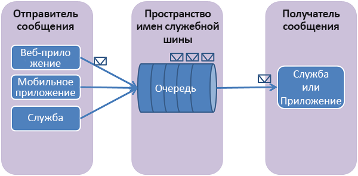

## Что такое очереди служебной шины?
Очереди служебной шины поддерживают модель **обмена сообщениями через посредника** . При использовании очередей компоненты распределенного приложения не взаимодействуют между собой напрямую, а обмениваются сообщениями через очередь, которая выступает в качестве посредника. Производитель (отправитель) передает сообщение в очередь, а затем продолжает его обработку. Потребитель сообщения (получатель) асинхронно извлекает сообщение из очереди и обрабатывает его. Поставщику не нужно ждать ответа от потребителя, чтобы продолжить обработку и отправку дальнейших сообщений. Очереди предлагают доставку сообщений конкурирующим потребителям по типу **FIFO** (первым пришел, первым вышел). То есть обычно получатели принимают и обрабатывают сообщения в том порядке, в котором они были добавлены в очередь, и каждое сообщение принимается и обрабатывается только одним потребителем сообщений.

Очереди служебной шины — это технология общего назначения, которая может использоваться для разнообразных сценариев:

* Взаимодействие между веб-ролями и рабочими ролями в многоуровневом приложении Azure.
* Обмен данными между локальными приложениями и приложениями, размещенными в Azure, в гибридном решении.
* Связь между компонентами распределенного приложения, которое работает в другой организации или в другом подразделении данной организации.

С помощью очередей можно лучше масштабировать приложения и сделать архитектуру более устойчивой.

