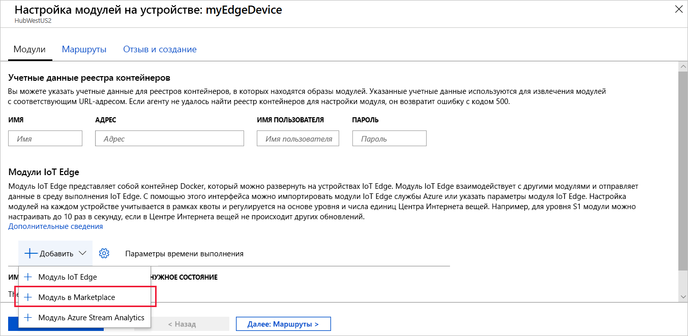

Одной из ключевых возможностей Azure IoT Edge является развертывание модулей на устройствах IoT Edge из облака. Модуль IoT Edge — это исполняемый пакет, который реализован как контейнер. В этом разделе мы развернем предварительно созданный модуль из [раздела модулей IoT Edge в Azure Marketplace](https://azuremarketplace.microsoft.com/en-us/marketplace/apps/category/internet-of-things?page=1&subcategories=iot-edge-modules). Этот модуль генерирует данные телеметрии для имитированного устройства.

1. На портале Azure в строку поиска введите `Simulated Temperature Sensor` и откройте результат поиска в Marketplace.

   

2. В поле **Подписка** выберите подписку с используемым Центром Интернета вещей, если вы не сделали этого ранее.

3. В поле **Центр Интернета вещей** выберите имя используемого Центра Интернета вещей, если вы не сделали этого ранее.

4. Щелкните **Найти устройство**, выберите свое устройство IoT Edge (с именем `myEdgeDevice`), а затем выберите **Создать**.

5. В мастере на шаге **добавления модулей** щелкните модуль **SimulatedTemperatureSensor**, чтобы проверить его параметры конфигурации, после этого нажмите кнопку **Сохранить** и **Далее**.

6. В мастере на шаге **указания маршрутов** проверьте, чтобы для всех маршрутов был настроен маршрут по умолчанию, который отправляет все сообщения из всех модулей в Центр Интернета вещей (`$upstream`). Если такого маршрута нет, добавьте приведенный ниже код, а затем щелкните **Далее**.

   ```json
    {
    "routes": {
        "route": "FROM /messages/* INTO $upstream"
        }
    }
   ```

7. В мастере на шаге **Проверка развертывания** выберите **Отправить**.

8. Вернитесь на страницу сведений об устройстве и выберите **Обновить**. Помимо модуля edgeAgent, который был создан при первом запуске службы, должен отобразиться еще один модуль среды выполнения с именем **edgeHub**, а также модуль **SimulatedTemperatureSensor**.

   Может потребоваться несколько минут, чтобы новые модули отобразились. Устройство IoT Edge должно получить сведения о новом развертывании из облака, запустить контейнеры и затем сообщить о своем состоянии в Центр Интернета вещей. 

   
