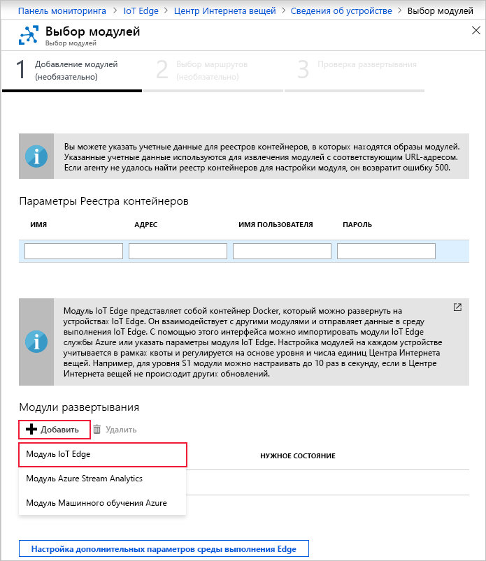
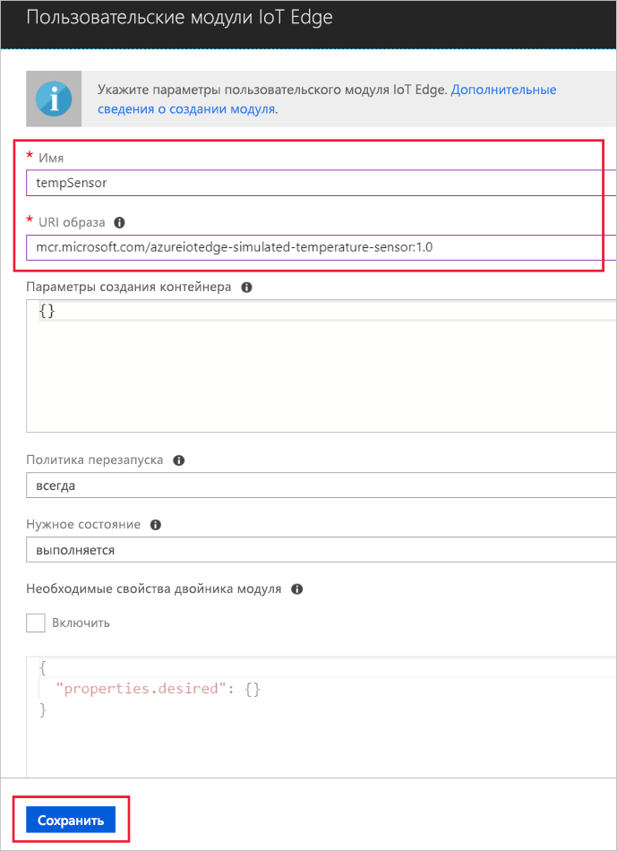

Одной из ключевых возможностей Azure IoT Edge является развертывание модулей на устройствах IoT Edge из облака. Модуль IoT Edge — это исполняемый пакет, который реализован как контейнер. В этом разделе вы развернете модуль, при помощи которого создаются данные телеметрии для имитированного устройства.

1. Найдите нужный Центр Интернета вещей на портале Azure.

2. Перейдите к **IoT Edge** в разделе **Автоматическое управление устройствами** и выберите свое устройство IoT Edge.

3. Щелкните **Set Modules** (Настроить модули). На портале откроется мастер для выполнения трех шагов: добавления модулей, указания маршрутов и проверки развертывания. 

4. В мастере на шаге **Добавление модулей** перейдите в раздел **Модули развертывания**. Щелкните **Добавить** и выберите **Модуль IoT Edge**.

   

5. В поле **Имя** введите `tempSensor`.

6. В поле **URI образа** введите `mcr.microsoft.com/azureiotedge-simulated-temperature-sensor:1.0`.

7. Оставьте без изменений другие параметры и выберите **Сохранить**.

   

8. В первом шаге мастера щелкните **Далее**.

9. В мастере на шаге **Указание маршрутов** необходимо настроить маршрут по умолчанию для отправки всех сообщений из всех модулей в Центр Интернета вещей. Если такого маршрута нет, добавьте приведенный ниже код, а затем щелкните **Далее**.

   ```json
   {
       "routes": {
           "route": "FROM /messages/* INTO $upstream"
       }
   }
   ```

10. В мастере на шаге **Проверка развертывания** выберите **Отправить**.

11. Вернитесь на страницу сведений об устройстве и выберите **Обновить**. Помимо модуля edgeAgent, который был создан при первом запуске службы, должен отобразиться еще один модуль среды выполнения с именем **edgeHub**, а также модуль **tempSensor**.

   Может потребоваться несколько минут, чтобы новые модули отобразились. Устройство IoT Edge должно получить сведения о новом развертывании из облака, запустить контейнеры и затем сообщить о своем состоянии в Центр Интернета вещей. 

   
