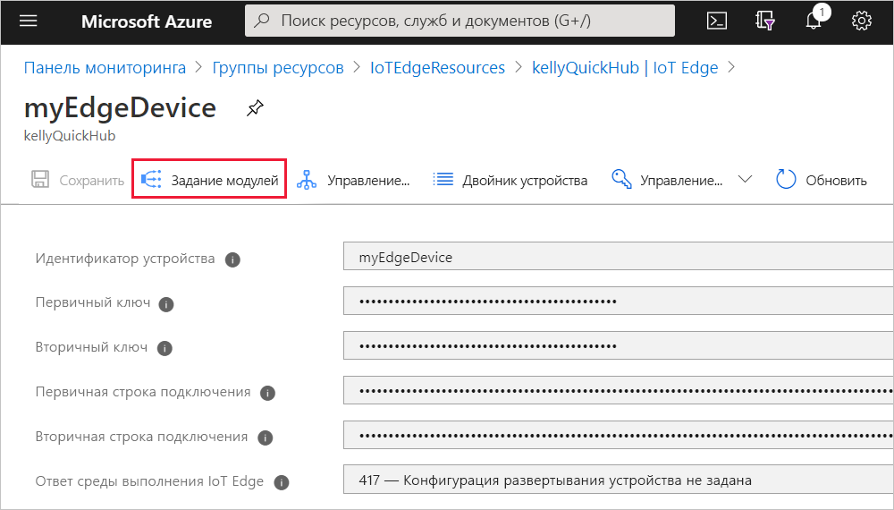
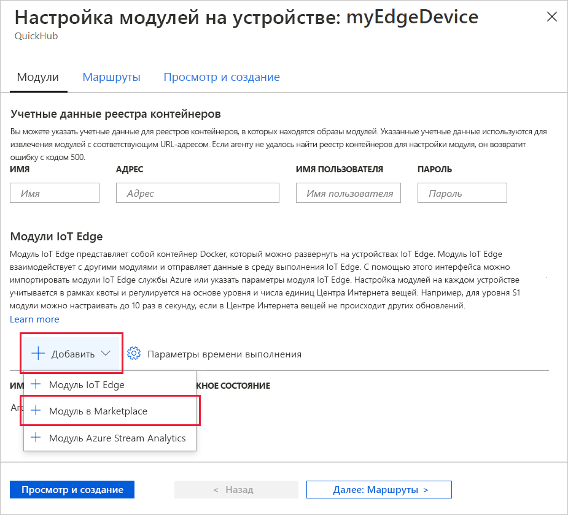
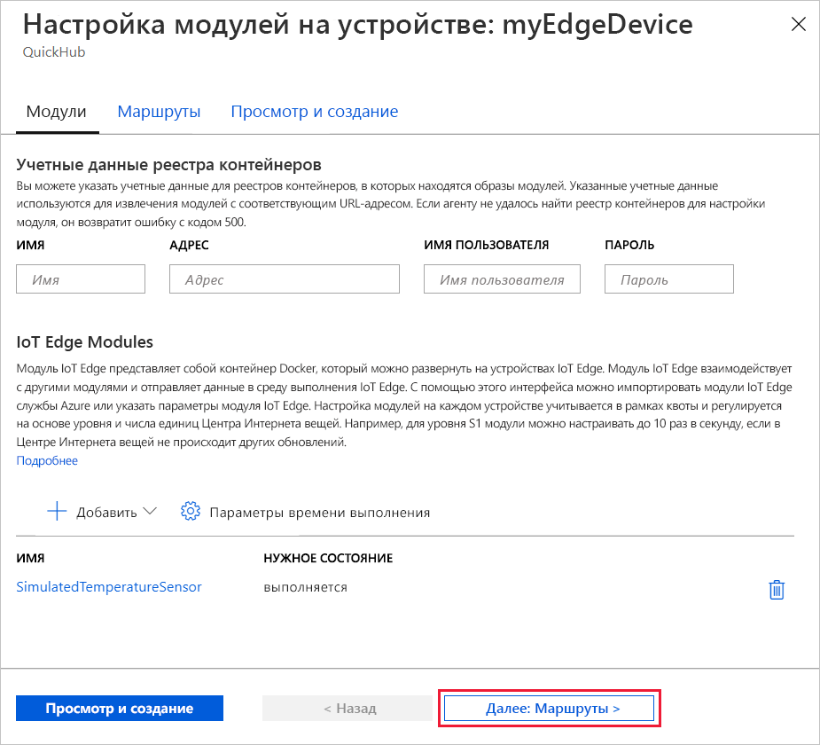
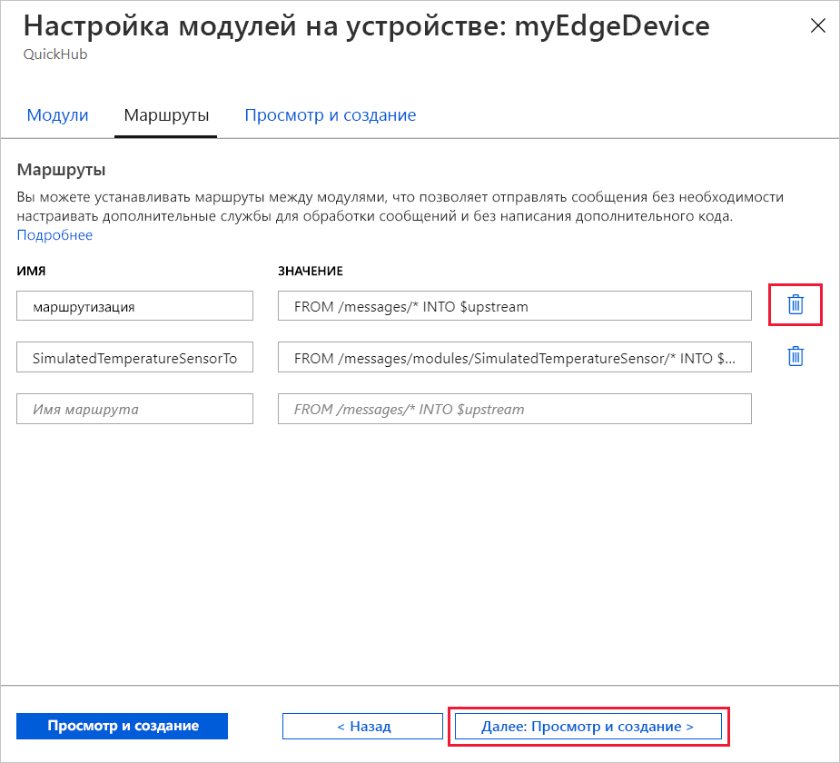
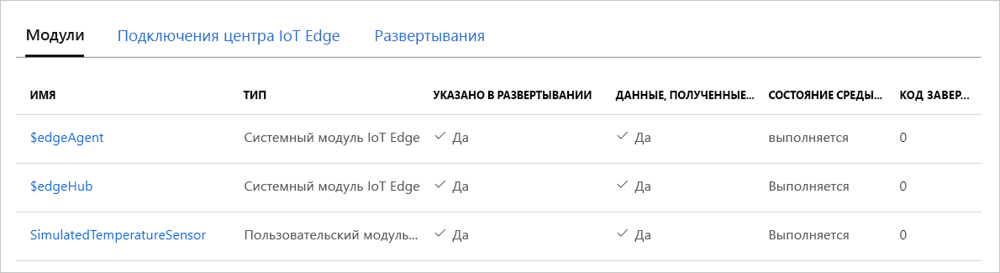

Одной из ключевых возможностей Azure IoT Edge является развертывание кода на устройствах IoT Edge из облака. *Модули IoT Edge* — это выполняемые пакеты, которые реализованы в виде контейнеров. В этом разделе будет развернут предварительно созданный модуль из раздела [Модули IoT Edge в Azure Marketplace](https://azuremarketplace.microsoft.com/marketplace/apps/category/internet-of-things?page=1&subcategories=iot-edge-modules) непосредственно из Центра Интернета вещей Azure.

Модуль, который будет развернут в этом разделе, имитирует поведение датчика и отправляет сгенерированные данные. Данный модуль является требуемой частью кода для начала работы с IoT Edge, так как сгенерированные данные вы можете использовать для разработки и тестирования. Если требуется увидеть полный функционал модуля, см. имитированный исходный код датчика температуры [здесь](https://github.com/Azure/iotedge/blob/027a509549a248647ed41ca7fe1dc508771c8123/edge-modules/SimulatedTemperatureSensor/src/Program.cs).

Выполните следующие шаги, чтобы развернуть первый модуль из Azure Marketplace.

1. Войдите на [портал Azure](https://portal.azure.com) и перейдите к своему Центру Интернета вещей.

1. В меню слева в разделе **Автоматическое управление устройствами** выберите **IoT Edge**.

1. Щелкните удостоверение целевого устройства в списке устройств.

1. На верхней панели выберите **Задание модулей**.

   

1. В разделе **Модули IoT Edge** на странице щелкните **Добавить** и в раскрывающемся меню выберите **Модуль в Marketplace**.

   

1. В разделе **Модуль IoT Edge в Marketplace** выполните поиск по запросу "Имитированный датчик температуры" и выберите этот модуль.

1. Обратите внимание, что модуль SimulatedTemperatureSensor добавляется в раздел модулей IoT Edge с требуемым состоянием **Выполняется**.

   По завершении выберите **Next: Routes** (Далее: маршруты), чтобы перейти к следующему шагу в мастере.

   

1. На вкладке **Маршруты** мастера вы можете определить способ передачи сообщений между модулями и Центром Интернета вещей. Маршруты создаются с использованием пар "имя-значение". На этой странице должны отображаться два маршрута. Маршрут по умолчанию с именем **Route** поддерживает отправку всех сообщений в Центр Интернета вещей (с именем `$upstream`). Второй маршрут с именем **SimulatedTemperatureSensorToIoTHub** создан автоматически при добавлении модуля из Marketplace. По этому маршруту в Центр Интернета вещей отправляются все сообщения из имитированного модуля температурного датчика. Вы можете удалить маршрут по умолчанию, так как он не нужен в этом случае.

   По завершении выберите **Next: Review + create** (Далее: просмотр и создание), чтобы перейти к следующему шагу мастера.

   

1. На вкладке **Просмотр и создание** мастера можно просмотреть файл JSON, определяющий все модули, которые развернуты на устройстве IoT Edge. Обратите внимание, что модуль **SimulatedTemperatureSensor** включен, как и два модуля среды выполнения: **edgeAgent** и **edgeHub**. После завершения просмотра выберите **Создать**.

   После отправки нового развертывания на устройство IoT Edge на ваше устройство ничего оправляться не будет. Вместо этого устройство регулярно выполняет запрос к Центру Интернета вещей для получения новых сведений. Если устройство обнаруживает обновленный манифест развертывания, оно использует информацию о новом развертывании для получения образов модуля с облака с последующим локальным запуском модулей. Это может занять несколько минут.

1. Когда вы укажете сведения о развертывании модуля, мастер вернет вас на страницу с подробными сведениями об устройстве. На этой странице проверьте состояние развертывания на вкладке **Модули**. В этом разделе должны быть указаны три модуля: $edgeAgent, $edgeHub и SimulatedTemperatureSensor. Если один или несколько модулей указаны в списке, как указано при развертывании, но не указаны устройством, то ваше устройство IoT Edge все еще запускает их. Подождите несколько секунд, а затем в верхней части страницы выберите **Обновить**.

   
