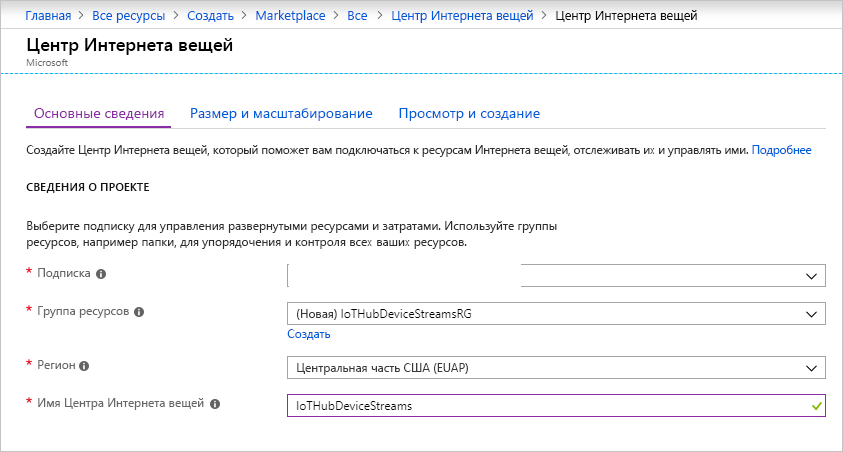
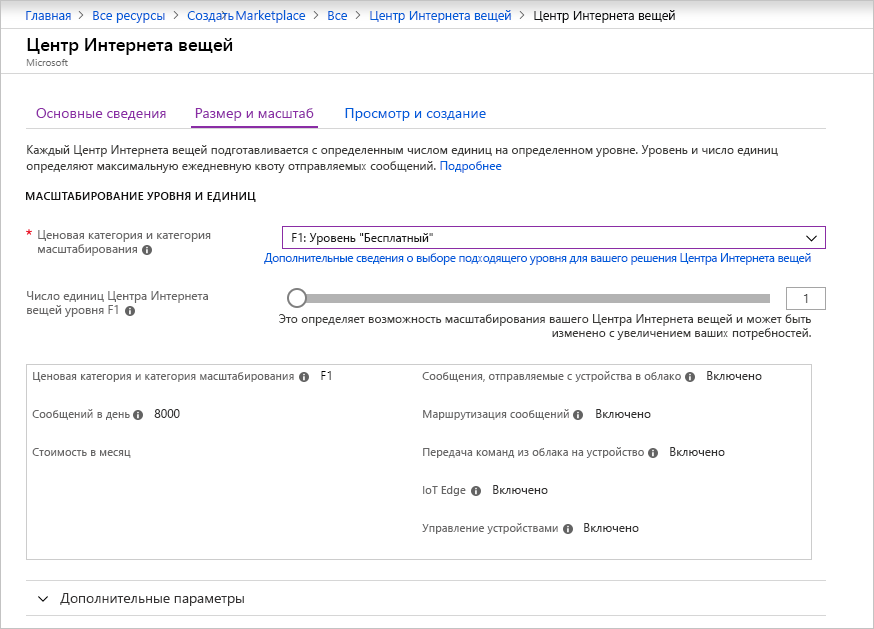
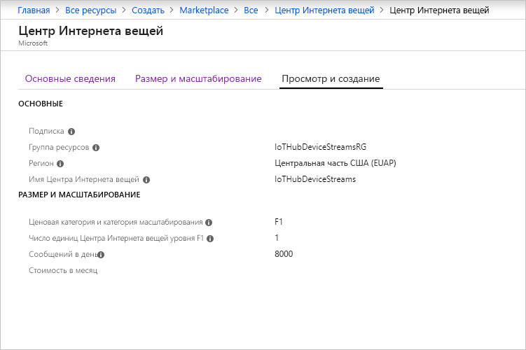

В этом разделе описывается создание центра Интернета вещей с помощью [портала Azure](https://portal.azure.com).

1. Войдите на [портале Azure](https://portal.azure.com).

1. Выберите **Создать ресурс**, а затем **Интернет вещей**.

1. В списке справа выберите **Центр Интернета вещей**. Откроется первая страница для создания центра Интернета вещей.

   

   Заполните следующие поля.

   a. В раскрывающемся списке **Подписка** выберите нужную подписку для центра Интернета вещей.

   b. Для **группы ресурсов** выполните одно из следующих действий. 
      * Чтобы создать группу ресурсов, щелкните **Создать** и укажите имя, которое вы хотите использовать. 
      * Чтобы использовать существующую группу, выберите **Использовать существующий**, а затем группу ресурсов из раскрывающегося списка. 
      
        Дополнительные сведения о группах ресурсов см. в статье об [управлении группами ресурсов в Azure Resource Manager](../articles/azure-resource-manager/manage-resource-groups-portal.md).

   c. В раскрывающемся списке **Регион** выберите регион, в котором будет расположен центр Интернета вещей. Выберите регион, который поддерживает функцию "Потоки устройств" центра Интернета вещей (предварительная версия). Это — **Центральная часть США** или **Центральная часть США (EUAP)** .

   d. В поле **Имя центра Интернета вещей** введите имя центра Интернета вещей. Оно должно быть глобально уникальным. Если введенное имя доступно, появится зеленая галочка.

   [!INCLUDE [iot-hub-pii-note-naming-hub](iot-hub-pii-note-naming-hub.md)]

1. Чтобы продолжить создание центра Интернета вещей, выберите **Далее: Размер и масштабирование**.

   

   На этой панели вы можете принять настройки по умолчанию и щелкнуть **Просмотр и создание** внизу страницы. Можно воспользоваться следующими вариантами:

   * В раскрывающемся списке **Ценовая категория и категория масштабирования** выберите один из стандартных уровней (**S1**, **S2**, **S3**) или **F1: Уровень "Бесплатный"** . Также этот выбор может основываться на размере вашего парка и характеристиках непотоковых рабочих нагрузок, которые будут выполняться в центре Интернета вещей (например, сообщения телеметрии). Например, для тестирования и оценки можно использовать бесплатный уровень. Он позволяет подключить к Центру Интернета вещей 500 устройств и отправлять до 8000 сообщений в день. Для каждой подписки Azure можно создать один центр Интернета вещей на уровне "Бесплатный". 

   * Для параметра **Число единиц центра Интернета вещей** этот выбор зависит от характеристик непотоковых рабочих нагрузок, которые будут выполняться в центре Интернета вещей. Сейчас можно выбрать 1.

   Дополнительную информацию о параметрах уровня см. в статье [Choose the right IoT hub tier](../articles/iot-hub/iot-hub-scaling.md) (Выбор правильного уровня центра Интернета вещей).

1. Щелкните вкладку **Просмотр и создание**, чтобы просмотреть возможные варианты. Панель, которая откроется, будет выглядеть примерно следующим образом.

   

1. Щелкните **Создать**, чтобы создать центр Интернета вещей. Процесс займет несколько минут.
