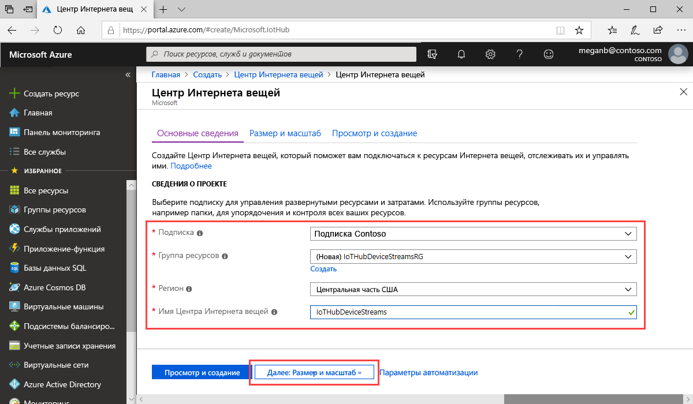

В этом разделе описывается создание центра Интернета вещей с помощью [портала Azure](https://portal.azure.com).

1. Войдите на [портале Azure](https://portal.azure.com).

1. Выберите **+Создать ресурс** и введите *Центр Интернета вещей* в поле **Поиск в Marketplace**.

1. В результатах поиска выберите **Центр Интернета вещей** и щелкните **Создать**.

1. Заполните следующие поля на вкладке **Основные сведения**.

   - **Подписка**: Выберите нужную подписку для концентратора.

   - **Группа ресурсов**. Выберите группу ресурсов или создайте новую. Чтобы создать новую, щелкните **Создать** и введите нужное имя. Чтобы выбрать существующую группу ресурсов, щелкните ее. Дополнительные сведения о группах ресурсов см. в статье об [управлении группами ресурсов в Azure Resource Manager](../articles/azure-resource-manager/manage-resource-groups-portal.md).

   - **Регион**. Выберите регион, в котором будет расположен концентратор. Выберите регион, который поддерживает функцию "Потоки устройств" центра Интернета вещей (предварительная версия). Это — **Центральная часть США** или **Центральная часть США (EUAP)** .

   - **Имя Центра Интернета вещей**. Введите имя для концентратора. Оно должно быть глобально уникальным. Если введенное имя доступно, появится зеленая галочка.

   

   [!INCLUDE [iot-hub-pii-note-naming-hub](iot-hub-pii-note-naming-hub.md)]

1. По завершении выберите **Next: Size and scale** (Далее: размер и масштаб), чтобы продолжить создание концентратора.

   

   На панели **Размер и масштабирование** вы можете принять настройки по умолчанию и щелкнуть **Просмотр и создание** внизу страницы. Можно воспользоваться следующими вариантами:

   - **Ценовая категория и категория масштабирования**. Выбранный уровень решения. Выберите один из стандартных уровней (**S1**, **S2**или **S3**) или **F1: Уровень "Бесплатный"** . Также этот выбор может основываться на размере вашего парка и характеристиках непотоковых рабочих нагрузок, которые будут выполняться в центре Интернета вещей, например сообщения телеметрии. Например, для тестирования и оценки можно использовать бесплатный уровень. Он позволяет подключить к Центру Интернета вещей 500 устройств и отправлять до 8000 сообщений в день. Для каждой подписки Azure можно создать один центр Интернета вещей на уровне "Бесплатный". 

   - **Число единиц центра Интернета вещей**: Допустимое число сообщений за единицу в сутки зависит от ценовой категории концентратора. этот выбор зависит от характеристик непотоковых рабочих нагрузок, которые будут выполняться в центре Интернета вещей. Сейчас можно выбрать 1.

   - **Дополнительные параметры Settings** > **С устройства в облако**: Это свойство привязывает сообщения, отправляемые с устройства в облако, к числу одновременно работающих модулей чтения этих сообщений. Для большинства концентраторов достаточно четырех разделов.

   Дополнительную информацию о параметрах уровня см. в статье [Choose the right IoT hub tier](../articles/iot-hub/iot-hub-scaling.md) (Выбор правильного уровня центра Интернета вещей).

1. Чтобы просмотреть выбранные параметры, щелкните **Просмотр и создание**. Результаты будут выглядеть примерно так:

   

1. Щелкните **Создать**, чтобы создать центр Интернета вещей. Процесс займет несколько минут.
