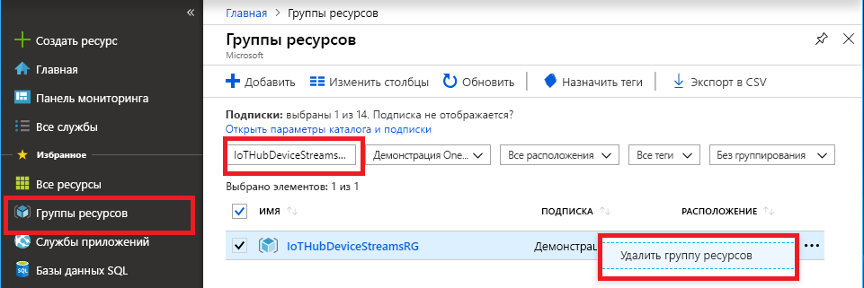

Можно сохранить созданные ресурсы и повторно использовать их при выполнении задач в следующей рекомендуемой статье, если вы планируете перейти к ней.

Если нет, вы можете удалить ресурсы Azure, созданные в рамках этой статьи, чтобы избежать расходов. 

> [!IMPORTANT]
> Удаление группы ресурсов — процесс необратимый. Группа ресурсов и все содержащиеся в ней ресурсы удаляются без возможности восстановления. Будьте внимательны, чтобы случайно не удалить не ту группу ресурсов или не те ресурсы. Если вы создали Центр Интернета вещей в группе ресурсов, содержащей ресурсы, которые нужно сохранить, удалите только ресурс Центра Интернета вещей, не удаляя всю группу ресурсов.
>

Удаление группы ресурсов по имени:

1. Войдите на [портал Azure](https://portal.azure.com) и щелкните **Группы ресурсов**.

2. Введите в текстовое поле **Фильтровать по имени...** имя группы ресурсов, содержащей Центр Интернета вещей. 

3. Справа от своей группы ресурсов в списке результатов щелкните **...**, а затем выберите **Удалить группу ресурсов**.

    

4. Подтвердите операцию удаления группы ресурсов. Еще раз введите имя группы ресурсов для подтверждения и нажмите кнопку **Удалить**. Через некоторое время группа ресурсов и все ее ресурсы будут удалены.