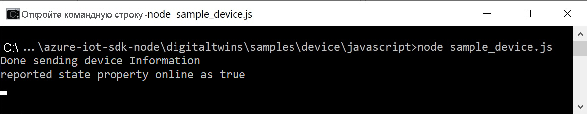

В этом кратком руководстве показано, как создать пример приложения устройства IoT Plug and Play, подключить его к Центру Интернета вещей и с помощью обозревателя Интернета вещей Azure просмотреть данные телеметрии, которые он отправляет. Пример приложения написан на языке Node.js и включен в пакет SDK для устройств Azure IoT для Node.js. Разработчик решения может использовать обозреватель Интернета вещей Azure, чтобы ознакомиться с возможностями устройства IoT Plug and Play, не просматривая код устройства.

## <a name="prerequisites"></a>Предварительные требования

[!INCLUDE [iot-pnp-prerequisites](iot-pnp-prerequisites.md)]

Для выполнения инструкций, приведенных в этом кратком руководстве, необходимо установить платформу Node.js на компьютере для разработки. Вы можете скачать последнюю рекомендуемую версию для нескольких платформ на сайте [nodejs.org](https://nodejs.org).

Текущую версию Node.js на компьютере, на котором ведется разработка, можно проверить, используя следующую команду:

```cmd/sh
node --version
```

## <a name="download-the-code"></a>Загрузка кода

С помощью этого краткого руководства вы подготовите среду разработки, которую можно использовать для клонирования и сборки пакета SDK для устройств Центра Интернета вещей Azure для Node.js.

Откройте командную строку в выбранном каталоге. Выполните следующую команду для клонирования репозитория [пакетов SDK для Интернета вещей Microsoft Azure для Node.js](https://github.com/Azure/azure-iot-sdk-node) с GitHub в это расположение:

```cmd/sh
git clone https://github.com/Azure/azure-iot-sdk-node
```

## <a name="install-required-libraries"></a>Установка обязательных библиотек

Используйте пакет SDK для устройств, чтобы выполнить сборку прилагаемого примера кода. Создаваемое приложение имитирует устройство, которое подключается к Центру Интернета вещей. Оно отправляет данные телеметрии и свойства, а также получает команды.

1. В окне локального терминала перейдите в папку клонированного репозитория, а затем в папку */azure-iot-sdk-node/device/samples/pnp*. Затем выполните следующую команду, чтобы установить обязательные библиотеки:

    ```cmd/sh
    npm install
    ```

1. Настройте переменную среды, используя строку подключения устройства, записанную ранее.

    ```cmd/sh
    set IOTHUB_DEVICE_CONNECTION_STRING=<YourDeviceConnectionString>
    ```

## <a name="run-the-sample-device"></a>Запуск примера устройства

В этом примере используется простой терморегулятор IoT Plug and Play. Модель, которую реализует этот пример, не использует [компоненты](../articles/iot-pnp/concepts-components.md) IoT Plug and Play. [Файл модели DTDL для терморегулятора](https://github.com/Azure/opendigitaltwins-dtdl/blob/master/DTDL/v2/samples/Thermostat.json) определяет данные телеметрии, свойства и команды, выполняемые устройством.

Откройте файл _simple_thermostat.js_. Из этого файла вы узнаете, как выполнять такие действия:

1. импортирование необходимых интерфейсов;
1. создание обработчика изменения свойства и команд;
1. обработка необходимых исправлений свойства и отправка телеметрии;
1. подготовка устройства с помощью Службы подготовки устройств Azure (DPS).

В основной функции вы можете увидеть, как все это происходит вместе:

1. Создайте устройство из строки подключения или подготовьте его с помощью DPS.
1. Используйте параметр **modelID**, чтобы указать модель устройства IoT Plug and Play.
1. Включите обработчик команд.
1. Отправьте телеметрию с устройства в свой концентратор.
1. Получите двойников устройств и обновите сообщаемые свойства.
1. Включите нужный обработчик обновления свойства.

[!INCLUDE [iot-pnp-environment](iot-pnp-environment.md)]

Дополнительные сведения о примере конфигурации см. в [образце файла сведений](https://github.com/Azure/azure-iot-sdk-node/blob/master/device/samples/pnp/readme.md).

Запустите пример приложения для имитации устройства IoT Plug and Play, отправляющего данные телеметрии в ваш центр Интернета вещей. Чтобы запустить пример приложения, используйте следующую команду:

```cmd\sh
node simple_thermostat.js
```

Вы увидите приведенный ниже результат, который указывает на то, что устройство начало отправлять данные телеметрии в центр и готово к получению команд и обновлений свойств.



Продолжите работу примера, после того как выполните следующие действия.

## <a name="use-azure-iot-explorer-to-validate-the-code"></a>Проверка кода с помощью обозревателя Интернета вещей Azure

После запуска примера клиента устройства используйте обозреватель Интернета вещей Azure, чтобы убедиться, что он работает.

[!INCLUDE [iot-pnp-iot-explorer.md](iot-pnp-iot-explorer.md)]
