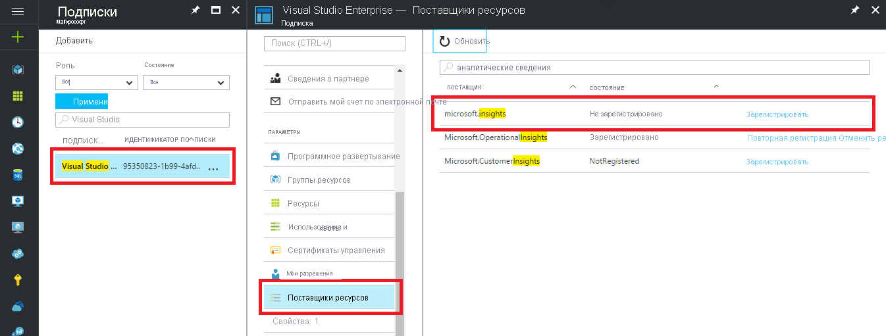

### Устранение неполадок системы диагностики Azure

Если появляется следующее сообщение об ошибке, это значит, что поставщик ресурсов Microsoft.insights не зарегистрирован:

`Failed to update diagnostics for 'resource'. {"code":"Forbidden","message":"Please register the subscription 'subscription id' with Microsoft.Insights."}`

Чтобы зарегистрировать поставщик ресурсов, сделайте следующее на портале Azure:

1.  Слева в области навигации щелкните *Подписки*.
2.  Выберите подписку, указанную в сообщении об ошибке.
3.  Щелкните *Поставщики ресурсов*.
4.  Найдите поставщика *Microsoft.insights*.
5.  Щелкните ссылку *Зарегистрировать*.

Зарегистрировав поставщик ресурсов *Microsoft.insights*, повторите настройку диагностики.

Если появляется следующее сообщение об ошибке, необходимо обновить версию PowerShell:

`Set-AzDiagnosticSetting : A parameter cannot be found that matches parameter name 'WorkspaceId'.`

Обновите версию Azure PowerShell, следуя инструкциям в статье [Установка Azure PowerShell](/powershell/azure/install-az-ps).
