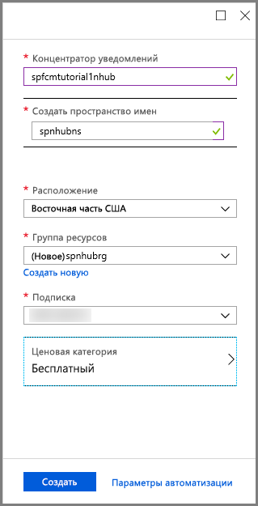
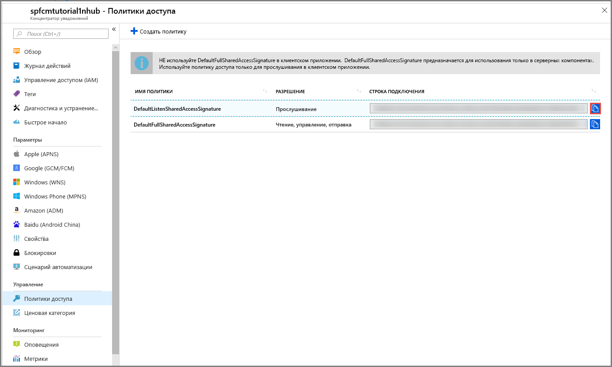

1. Войдите на [портале Azure](https://portal.azure.com).

2. Выберите **Создать ресурс** > **Мобильные устройства** > **Концентратор уведомлений**.

      

3. В поле **Центр уведомлений** введите уникальное имя. Выберите **регион**, **подписку** и **группу ресурсов** (если она уже создана).

      Если у вас нет пространства имен служебной шины, можно использовать имя по умолчанию. Оно создается на основе имени концентратора (если имя пространства имен доступно).

      Если у вас уже есть пространство имен служебной шины, в котором требуется создать концентратор, сделайте следующее:

    a. В области **Пространство имен** выберите ссылку **Выбрать существующее**.

    b. Нажмите кнопку **Создать**.

    

4. Последовательно выберите **Уведомления** (значок колокольчика) и **Go to resource** (Перейти к ресурсу).

      
5. Выберите **Политики доступа** в списке. Запишите две строки подключения, которые отобразятся. Они требуются для дальнейшей обработки push-уведомлений.

      >[!IMPORTANT]
      >**НЕ** используйте в приложении DefaultFullSharedAccessSignature. Этот параметр можно использовать только в серверной части.
      >

      
